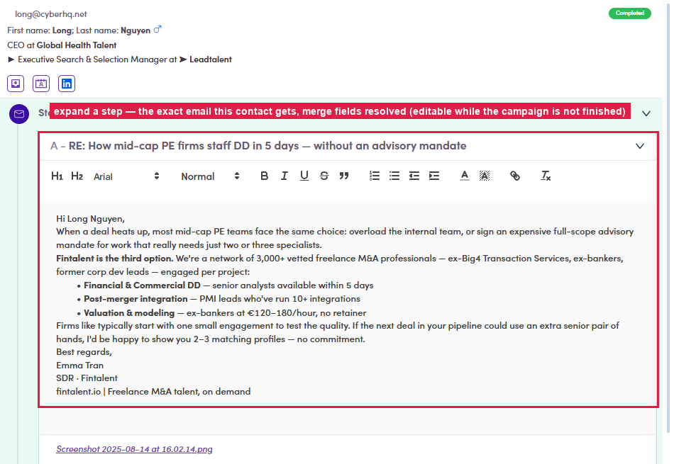

# 6.5.2 · Read each step

> 6 · Manage a campaign → 6.5 · Preview & review

**Expand a step and read it.** Each row opens into **the exact email that contact will get**, merge fields resolved (“Hi Long Nguyen,” — their real name, title, company). Read every step the way the prospect will.

*6.5.2 — an expanded step: the resolved email in a full editor.*
