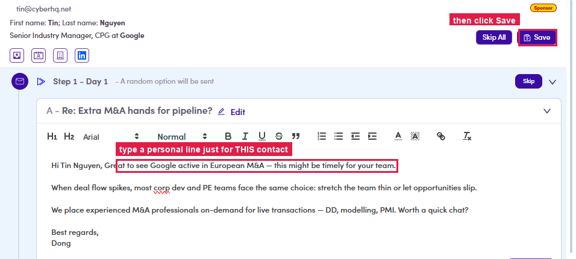
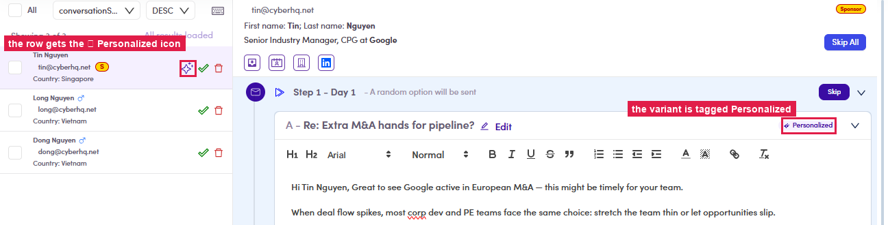

# 6.5.3 · Personalize + Save

> 6 · Manage a campaign → 6.5 · Preview & review

**Personalize** a step for **this one contact** if it needs it. The expanded step is a full editor, so type your personal line straight in, then click **Save** (top-right). A **✨ Personalized** icon appears on their row and the variant is tagged **✨ Personalized**; everyone else keeps the standard copy. (Editing works while the campaign is Draft / Scheduled / Running, a **Finished** campaign's preview is read-only.)

*6.5.3: type a personal line just for this contact (highlighted) → click Save.*

*6.5.3: after Save: the contact's row gets the ✨ icon and the variant is tagged ✨ Personalized.*
