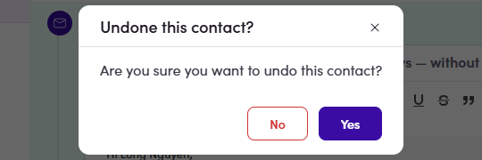

# 6.5.4 · Mark done ✓

> 6 · Manage a campaign → 6.5 · Preview & review

**Mark the contact done — or skip.** Don't want a step (or the whole sequence) to go to this contact? Each step row has a **Skip** button, and **Skip All** (top-right) skips every step — skipped contacts show under the **Skipped** filter (what Skip actually does → [6.x.13 ↗](6-x-13-skip-a-step-not-sent.md)). When their steps are reviewed, click the **green ✓** on their row → confirm **“Done this contact?”** → the row shows a **(Done)** tag. Made a mistake? The **↺ undo** icon asks **“Undone this contact?”** and clears it. Track progress with the **Personalize / Done / Skipped** filters (top-left). Once a contact replies, each step also carries their **reply-category** chip (e.g. **Not Interested**).

*6.5.4 — the ✓ asks Done this contact? → the row gets the (Done) tag.*

*6.5.4 — the ↺ undoes it (Undone this contact?).*
