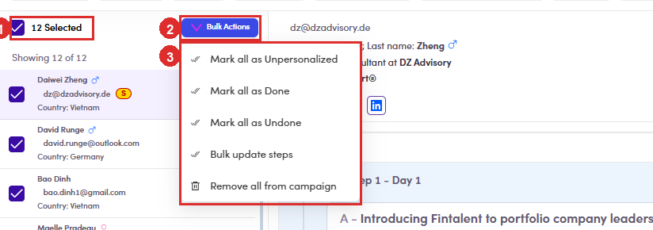
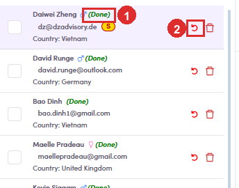

# 6.5.5 · Bulk Actions

> 6 · Manage a campaign → 6.5 · Preview & review

**Or mark the whole list at once.** Reviewing twelve people one tick at a time is fine. Reviewing two hundred is not, so tick **All** at the top of the contact list and a **Bulk Actions** button appears beside the count. **What Done looks like afterwards:** every row picks up the **(Done)** tag and the green tick becomes the undo arrow, exactly as if you had ticked each one.

*6.5.5: ① how many you have selected · ② Bulk Actions · ③ the five things it can do.*

| Menu item | What it does to everyone selected |
|---|---|
| **Mark all as Done** | the same tick as above, applied to the lot. |
| **Mark all as Undone** | clears it again. |
| **Mark all as Unpersonalized** | throws away the per-contact copy and puts everyone back on the standard step. |
| **Bulk update steps** | edit the step itself and push it to all of them ([6.x.19 ↗](6-x-19-bulk-update-steps.md)). |
| **Remove all from campaign** | takes them out of the campaign entirely. |

*6.5.5: after Mark all as Done: ① the (Done) tag · ② the undo arrow that replaced the tick.*

> **None of the five asks you to confirm**
>
> The single-row tick pops a dialog. **The bulk versions do not.** Click the menu item and it has already happened to everyone selected, including **Remove all from campaign**, which sits one row below **Bulk update steps** in the same menu. **Read the count on the left before you open the menu.** Your selection is cleared after each action, so a second bulk action means ticking **All** again. Slightly annoying, and the only thing standing between two clicks and the wrong list.
