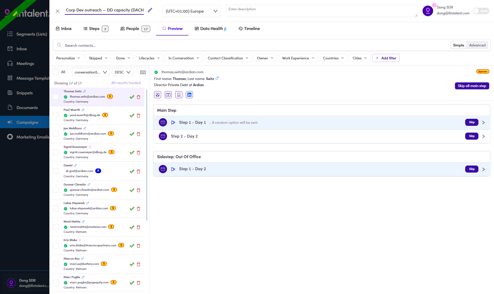

# 6.5.5 · What else is on the Preview screen

> 6 · Manage a campaign → 6.5 · Preview & review

The steps in 6.5.1–6.5.4 are the walk-through. This page is everything else on that screen, because most of it carries information you need to judge a contact.

## The contact list, left

**Sort bar** — an **All** checkbox, a sort-field dropdown, an **ASC / DESC** dropdown, and the [keyboard-shortcuts icon](6-13-keyboard-shortcuts.md) at the right-hand end.

**Each row** carries, in order: the name with a **gender icon**, a green **✓** if the email is verified, the address itself, a **coloured company badge**, and the country.

| Badge | Means |
|---|---|
| orange **`S`** | the contact works at a **Sponsor** — a PE fund |
| blue **`P`** | the contact works at a **Portfolio** company — one a fund owns |

**This is the fastest client check you have.** An `S` badge is the same signal that makes somebody a client in [A6-B](a6-b-identify-passive-talent.md) — a person sitting at a fund. Worth a second look before you send them a pitch.

Two icons sit at the right of every row: a green **✓** (mark done, keyboard `E`) and a red **🗑** (remove from campaign, keyboard `O`).

## The contact panel, right

The header repeats the email, the **First name / Last name** as they will merge into the template, and the current **title at company** — plus the same **`Sponsor`** pill in the corner when it applies. Four icon buttons open the contact, the company, the signal and LinkedIn.

**`Skip all main step`** sits top-right. It skips every main step for this one contact in a single click, leaving any sidestep alone.

## The steps, below

Each block from the [Steps tab](6-2-build-the-sequence.md) is repeated here with a **`Skip`** button and a **`>`** chevron to expand the actual copy that will go out.

> **"A random option will be sent"** appears next to any step that has more than one variant. That is the answer to how A/B variants pick: **at random, per contact** — not alternating, and not something you choose. See [6.x.1 ↗](6-x-1-a-b-variants.md).

**One wording inconsistency to expect:** the Steps tab calls the conditional block **"Side Step: Out Of Office"**, the Preview screen calls the same block **"Sidestep: Out Of Office"**. Same thing.
