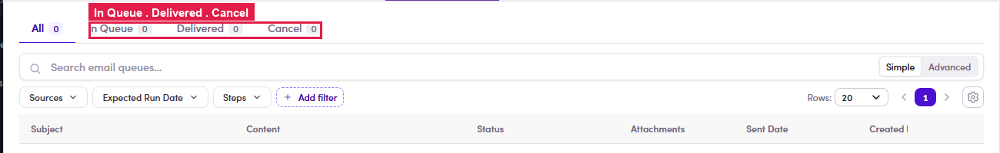

# 6.7 · Email Queue

> 6 · Manage a campaign

Once the campaign is running, the **Email Queues** tab holds every queued send in the same three tabs as a Marketing Email — **In Queue · Delivered · Cancel** (+ All) — with columns **Subject / Content / Status / Attachments / Sent Date / Created** and filters for **Sources / Expected Run Date / Steps**.

*6.7 — the campaign Email Queue: tabs In Queue · Delivered · Cancel and the queue columns.*

**Heads-up:** as with Marketing Emails, the SDR **Email Queues** list can be slow or show **0 / “Couldn't load”** even when the campaign has already delivered. If it looks empty, refresh, or confirm via the [campaign Inbox (6.8)](6-8-verify-replies.md) and the contact's Conversations.
