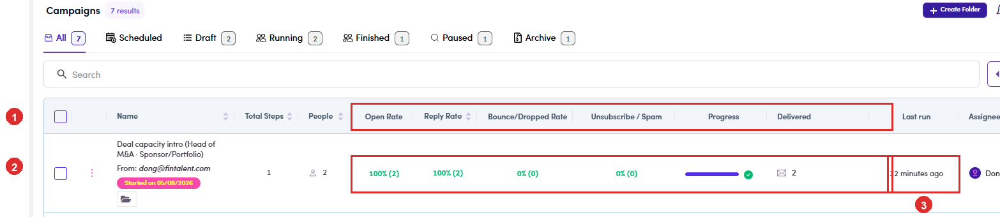

# 6.8.1 · Read the numbers

> 6 · Manage a campaign → 6.8 · Verify: Inbox & replies

**Read the numbers on the campaign row.** The **Campaigns** list carries the result of the send in a single line, and it is the fastest way to see where a campaign stands. Each column is explained on its own in [6.3 ↗](6-3-view-campaigns.md); what matters here is reading them together. A blank rate is not a bad rate, it means nothing has been sent yet. **0%** on a campaign that has delivered is a real result, and a different conversation.

*6.8.1: ① the metric columns · ② the same row on a campaign that has finished a step: 100% (2) opened, 100% (2) replied, bounce and unsubscribe at 0%, the progress bar full with a green tick, Delivered 2 · ③ Last run, here \*32 minutes ago\*.*

| Read | To answer |
|---|---|
| **Progress** + **Delivered** | how much of the sequence has actually gone out. The bar fills per step, not per person. |
| **Open Rate** | whether the subject line earned the click. The weakest of the three, and the easiest to over-read. |
| **Reply Rate** | the number the campaign is judged on. |
| **Bounce / Dropped Rate** | a to-do list, not a score ([6.8.7 ↗](6-8-7-bounced-dropped.md)). |
| **Unsubscribe / Spam** | the one that should stay at **0**. Anything else is a content problem to raise before the next send. |
| **Last run** | when a step last went out. Steps remaining plus an old **Last run** means the campaign has stalled. |
