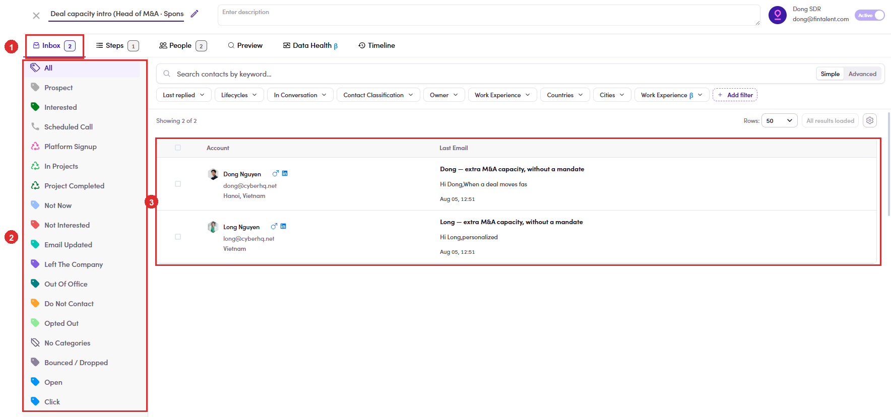

# 6.8.2 · Open the Inbox

> 6 · Manage a campaign → 6.8 · Verify: Inbox & replies

**Open the Inbox tab.** Nothing lands here until mail is actually **Delivered** ([6.7 ↗](6-7-email-queue.md)). Once it is, every send and every reply for this campaign sits on **Inbox**, and that is where you work from now on. Down the left is the **category rail**: Prospect, Interested, Scheduled Call, Not Now, Not Interested, Out Of Office, Do Not Contact, Opted Out, No Categories, Bounced / Dropped, Open, Click. On the right, one row per contact with the last email on it. It is the same inbox as [Flow 4 ↗](4-view-replies-and-answer-replies.md), narrowed to this campaign. New replies also raise the **🔔 bell** ([6.x.14 ↗](6-x-14-notifications-bell.md)).

*6.8.2: ① the Inbox tab, with the count of what is waiting · ② the category rail · ③ one row per contact, newest email first.*
