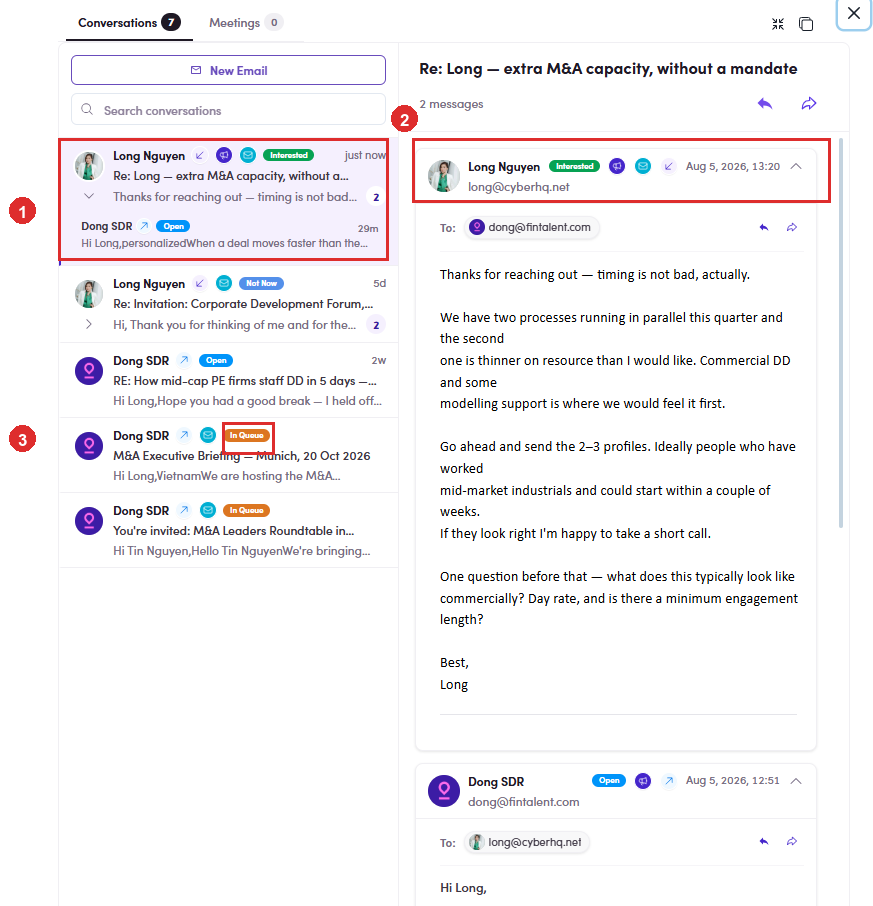
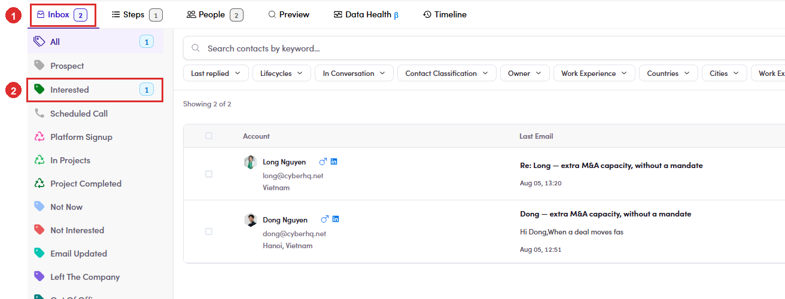

# 6.8.3 · Replies & their chips

> 6 · Manage a campaign → 6.8 · Verify: Inbox & replies

**Read the reply, and the chip the system put on it.** When a contact answers, **the reply is categorised for you** and carries a chip. The chip then travels with the conversation: on the message itself, on the row in the list, and on the rail, where a count appears beside the category. **The chip is a reading of the reply, not a decision.** Check it against what the person actually wrote before you act on it, because wording that scans as interest is sometimes a polite no. Setting the label yourself, and which labels stop the sending, is [6.9 ↗](6-9-label-the-replies.md).

*6.8.3: ① the reply in the conversation list, chipped Interested · ② the same chip on the message itself · ③ your own sends carry a status chip instead: Open, In Queue.*

*6.8.3: ① the tab count · ② the same reply counted on the rail, under Interested. Categories with nothing in them stay blank.*
