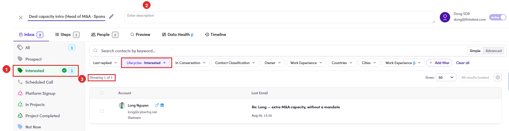

# 6.8.4 · Filter by category

> 6 · Manage a campaign → 6.8 · Verify: Inbox & replies

**Click a category to filter the list.** Clicking a category on the rail puts a green **✓** on it, drops a **Lifecycles : Interested** chip into the filter row, and narrows the list to that group. It is the **Lifecycles** filter, reached in one click. Clicking the same category a second time flips it to **exclude**, which hides that group instead of showing it ([6.x.24 ↗](6-x-24-exclude-a-category.md)). **Clear all** puts the list back.

*6.8.4: ① Interested clicked, now ticked · ② the chip it added to the filter row · ③ the list narrows to Showing 1 of 1.*

> **Three of these categories return nothing today**
>
> **Open**, **Click** and **Bounced / Dropped** come back empty however much traffic the campaign has, because the rail sends them through the **Lifecycles** filter and none of the three is a lifecycle. Logged as [CMP-13 ↗](cmp-13-open-click-bounced.md), still open. **Last replied** also misses the day you filter on ([CMP-14 ↗](cmp-14-last-replied.md)).
