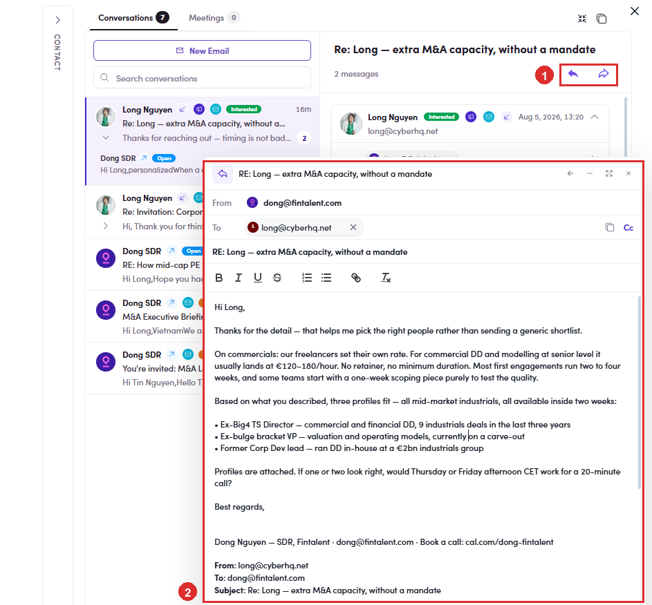

# 6.8.5 · Answer a reply

> 6 · Manage a campaign → 6.8 · Verify: Inbox & replies

**Answer it, or leave it alone.** What the chip says decides which: To answer, click the **↩** arrow on the message. The composer opens over the thread with **From**, **To** and the **Re:** subject already filled in, so you are only writing the body. Writing the reply itself, tone and what to send, is [Flow 4 · View & answer replies ↗](4-view-replies-and-answer-replies.md). **New Email** at the top of the list starts a fresh thread rather than a reply.

| Chip | What to do |
|---|---|
| **Interested** · **Scheduled Call** | answer now, this is the point of the sequence. Book the call in [Flow 4b ↗](4b-schedule-a-call.md). |
| **Out Of Office** · **Not Now** | leave it. The later steps will reach them again, and a sidestep can handle the out-of-office case on its own ([6.x.2 ↗](6-x-2-sidestep-conditional.md)). |
| **Email Updated** · **Left The Company** | the person is reachable, the address is not. Get the contact corrected before anything else goes out. |
| **Not Interested** · **Opted Out** · **Do Not Contact** | do not answer. Take them off the campaign instead ([6.8.6 ↗](6-8-6-chips-that-end-it.md)). |

*6.8.5: ① the reply arrow on the message · ② the composer, prefilled, with the thread quoted underneath.*
