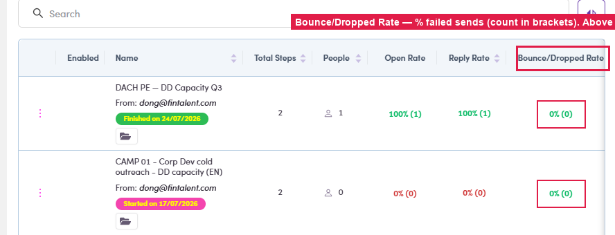
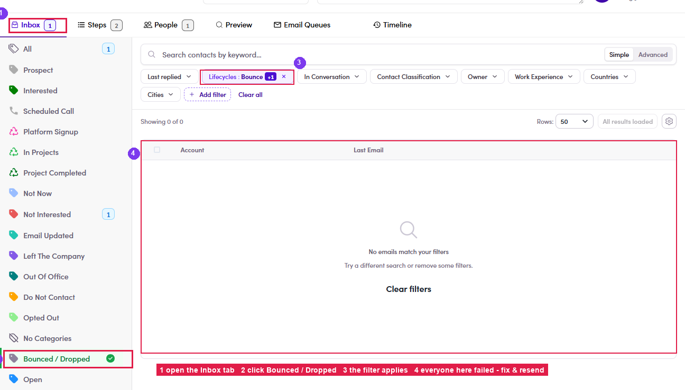

# 6.8a · Find bounces & drops

> 6 · Manage a campaign → 6.8 · Verify replies

A **bounce / drop** means that contact **never got the email**. Check for them after every run: step by step:

## 6.8a.1 · Spot it on the list

On **Campaigns**, read the **Bounce/Dropped Rate** column, anything **above 0%** (count in brackets) means failed sends inside.

*6.8a.1: the Bounce/Dropped Rate column on the campaign list.*

## 6.8a.2 · See exactly who

Open the campaign → **Inbox** tab → click the **Bounced / Dropped** category (left rail). The filter applies and **everyone listed is a failed send**.

*6.8a.2: ① Inbox tab → ② Bounced / Dropped → ③ the filter applies → ④ everyone here failed.*

## 6.8a.3 · Fix & re-reach

For each failed contact: open their profile and get the **email address corrected** (flag it to Admin / Ops if you can't edit it), then **reach them another way**: a [1:1 email (Flow 3) ↗](3-send-a-1-1-email.md) to a working address, or [WhatsApp / LinkedIn (3.x.4) ↗](3-x-4-whatsapp-linkedin-instead.md). Once the address is fixed, Admin / Ops can re-add them to the next run.
