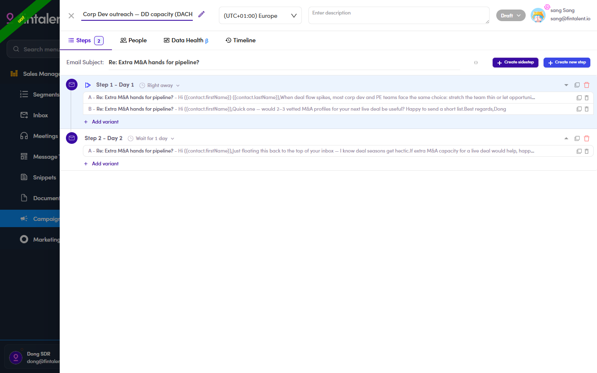

# 6.x.1 · A/B variants

> 6 · Manage a campaign → 6.x · Edge cases

**A/B variants.** Under any step, **+ Add variant** creates an alternative email (**A**, **B**, …) for that step — each contact gets **one variant at random** (on the Preview the step reads *“A random option will be sent”*), so you can test subject / copy.

*6.x.1 — Step 1 with two variants A and B.*
