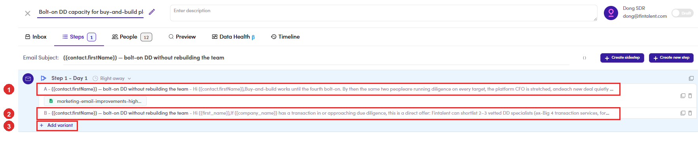
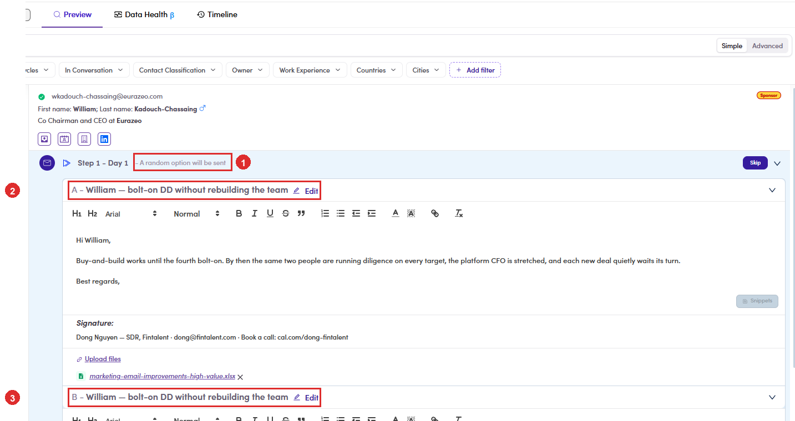

# 6.x.1 · A/B variants

> 6 · Manage a campaign → 6.x · Edge cases

**A/B variants: two versions of the same step.** A step normally holds one email. **+ Add variant** under the step adds another, lettered **A**, **B** and so on, and **each contact receives exactly one of them, picked at random when the step goes out**. Nobody gets both. That is how you test a subject line or an opening against real replies rather than against an opinion. **Where you write them:** the **Steps** tab, one row per variant under the step, each with its own subject, body and attachment. **Where you check them:** the **Preview** tab. The step line says *“A random option will be sent”* and both variants are listed underneath, each openable and editable, so you review every version that could reach that person. **The split is a weighting, not a coin toss.** Each variant carries a **percentage weight**, and the weights on a step always add up to **100**, checked across **every step, 118 records, all summing to exactly 100**. One variant is `100`; two variants are `50` / `50`. So “random” means *drawn against the weights*, not *even by accident*. **Variants live inside a branch.** A sidestep gets its own **+ Add variant** per step, independent of the main sequence ([6.x.2 ↗](6-x-2-sidestep-conditional.md)). **Which address it sends from.** Every variant stores its own **From** address and **signature**, but the editor never shows either. Across **36 campaigns every campaign uses exactly one sender**, the owner’s address, so a variant does not change who the email comes from. **The risk sits on the owner:** reassign the campaign and the sender changes with it, silently, because nothing on screen names the address in use.

*6.x.1: one step, two variants. ① variant A, here with a file on it · ② variant B, a different opening · ③ + Add variant for a third. The Steps badge still reads 1: variants are versions of one step, not extra steps.*

*6.x.1: ① \*A random option will be sent\*, on the step line · ② variant A · ③ variant B below it. Which one this contact gets is not decided yet.*

> **Preview cannot tell you which one they will get**
>
> The pick happens at send time, not at review time, so the Preview shows you every possibility rather than the outcome. Read all of them: **personalizing only variant A leaves half your contacts receiving the unedited B** ([6.5.4 ↗](6-5-4-personalize-save.md)).

> **No control for the weight was found in the editor**
>
> The number exists on the record and is always an even split in the data, so whether it can be changed, and where, is **unverified**. Do not promise a client a 70/30 test until that is answered.
