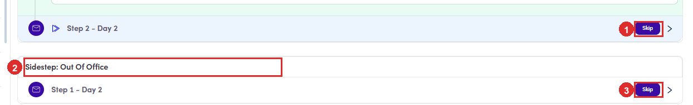

# 6.x.13 · Skip a step (= not sent)

> 6 · Manage a campaign → 6.x · Edge cases

**Skip: three buttons, and they do not cover the same ground.** **Skip means that email is not sent to that contact.** Nothing asks you to confirm, and the step is tagged **Skipped** straight away with the button becoming **Rollback Skip**. **Changed your mind? Rollback Skip puts it back.** A skipped step turns green and the **Skip** button is replaced by **Rollback Skip**, sitting in the same place. Click it and the step is back in the sequence for that contact, with the **Skipped** tag gone. It asks nothing, the same as skipping did, and you can go back and forth as often as you like while the campaign has not sent that step yet. Skipped contacts are what the **Skipped** filter at the top of the list surfaces, so that is where you find everyone you have taken out of a step without leaving the campaign.

| Button | Where it is | What it skips |
|---|---|---|
| **Skip** | on a step row | that one step, for that one contact. |
| **Skip all main step** | top-right of the contact | **every step under Main Step**. It does **not** touch a sidestep. |
| **Skip** on a sidestep row | under the Sidestep heading | that branch step. Branches have no bulk button of their own. |

*6.x.13: ① a main step still to go · ② the branch, listed separately · ③ its own Skip, which \*Skip all main step\* never reaches.*

*6.x.13: a step after Skip: ① Rollback Skip, where the Skip button was · ② the Skipped tag. The whole row goes green.*

> **Skip one step by hand and you lose the bulk button**
>
> Measured: skipping a single main step makes **Skip all main step** **disappear** for that contact, with the remaining steps still unskipped and no bulk way to reach them. You are left skipping the rest one at a time, or rolling the first one back to bring the button home. **So if you want the whole main sequence skipped, use Skip all main step first.** Doing it in the other order costs you the shortcut.
