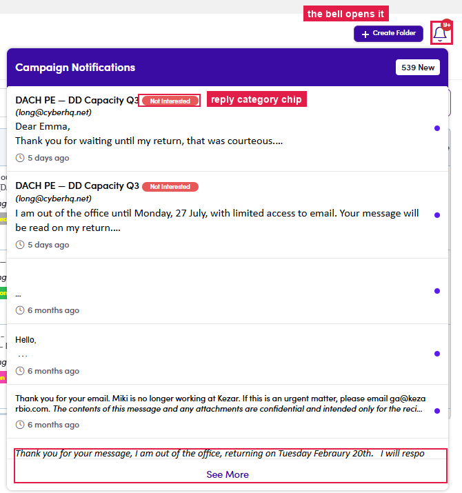

# 6.x.14 · Notifications bell

> 6 · Manage a campaign → 6.x · Edge cases

**The 🔔 bell — Campaign Notifications.** The bell (top-right, next to Create Folder) opens **Campaign Notifications** — a feed of every reply your campaigns pulled in: the **campaign name**, the **reply-category chip**, the contact, a snippet of the reply and how long ago. A **purple dot** = unread; **See More** loads older ones. Use it as your morning sweep — spot fresh replies without opening each campaign.

*6.x.14 — the bell opens Campaign Notifications: campaign + category chip + reply snippet.*
