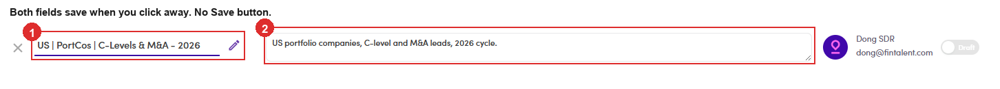

# 6.x.15 · Rename · description

> 6 · Manage a campaign → 6.x · Edge cases

**Rename a campaign, or give it a description.** Both sit in the **header of the campaign**, and both are live text boxes rather than a form you open. Click the name (or the **✎** beside it, which only moves the cursor there), type, then **click away**. The description box sits next to it reading *Enter description* until you fill it in. The description is for you and your team; it is never sent to anyone.

*6.x.15: ① the name, always editable · ② the description.*

> **There is no Save button, and no message either**
>
> The change is written the moment the box loses focus. Nothing flashes to confirm it, so if you want to be sure, reload the page and read it back. Equally, **a stray keystroke in the name field is already saved** by the time you notice.
