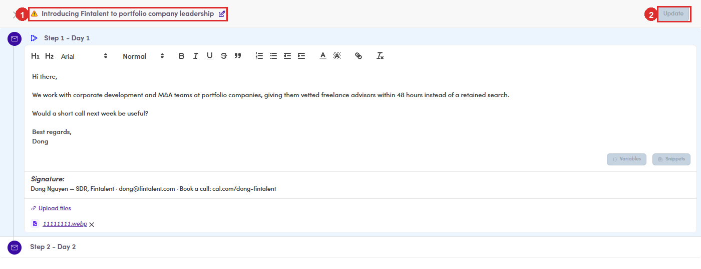

# 6.x.19 · Bulk update steps

> 6 · Manage a campaign → 6.x · Edge cases

**Bulk update steps.** The last of the editing actions in **Bulk Actions**. It opens the step editor full screen, with every step of the campaign listed, so you can change the copy once and push it to everyone selected rather than opening them one at a time. **The warning beside the subject is worth reading.** It says the subject is **reused across the campaign**, so changing it here changes it on **every** step, unless a step has already been submitted. Bodies are per step; the subject is not. Same family as **Force Update** ([6.x.12 ↗](6-x-12-force-update.md)), and the same caution applies: pushing a step over people who have personalized copy replaces what they wrote.

*6.x.19: ① the subject, carrying a warning · ② Update, which stays greyed out until you change something.*
