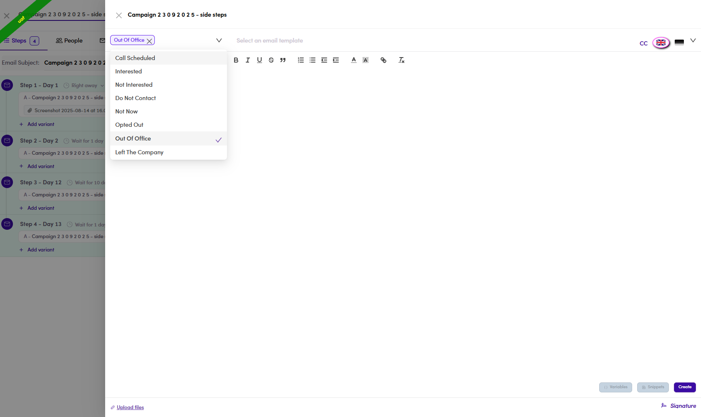
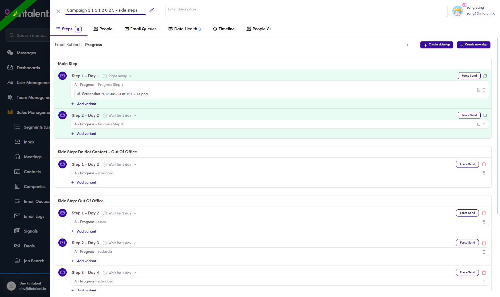

# 6.x.2 · Sidestep (conditional)

> 6 · Manage a campaign → 6.x · Edge cases

**Sidestep — a conditional branch.** A sidestep is an email that fires **automatically when a
contact's reply lands in a chosen category** — e.g. an auto-response to an **Out Of Office**.

## Build one

**Steps** tab → **+ Create sidestep**, then:

1. **Pick the trigger conditions** — the chip control at the top-left of the editor. **It takes more
   than one.** A new sidestep opens with **Out Of Office** already selected; each condition sits in a
   chip with an **✕** to remove it.

   The list offers **nine**: **Call Scheduled · Interested · Not Interested · Do Not Contact ·
   Not Now · Opted Out · Out Of Office · Left The Company · No Categories**.

2. **Write the email** — same editor as any step; template, variables, snippets and attachments all
   work → **Create**.



*6.x.2 — the condition control is a multi-select: `Out Of Office ✕` is already a chip, and the tick
marks it in the list. Add as many conditions as should fire the same branch.*

## What the Steps tab looks like afterwards

The tab lays out **Main Step** first, then **one block per branch**, each headed
**`Side Step: ‹conditions›`**. Several branches can live side by side, and **a branch is a sequence of
its own** — its own steps, its own day offsets.



*6.x.2 — `Campaign 1 1 1 1 2 0 2 5` on UAT: Main Step (2 steps) plus four branches. `Side Step: Out Of
Office` runs three steps of its own on Day 2, Day 3 and Day 4.*

```
Main Step
   Step 1 – Day 1    Right away
   Step 2 – Day 2    Wait for 1 day

Side Step: Do Not Contact - Out Of Office
   Step 1 – Day 2

Side Step: Out Of Office
   Step 1 – Day 2
   Step 2 – Day 3            ← a branch can be a whole sequence
   Step 3 – Day 4

Side Step: Left The Company
   Step 1 – Day 2

Side Step: Not Now - Out Of Office
   Step 1 – Day 2
```

**Two conditions in one header are joined by a hyphen** — `Side Step: Do Not Contact - Out Of Office`
is *one* branch that fires on either category, not two branches.

> **The Steps badge counts every step in every branch.** The campaign above reads **Steps 8** — two
> main steps plus six across the four branches. A badge higher than the main sequence is not a bug;
> open the tab and count the branches.

> **The same category can appear in two branches.** Above, *Out Of Office* sits in three of the four
> headers. Nothing in the UI warns about the overlap and nothing states which branch wins.
> **Untested — do not build two branches on one category until this is settled.**

## What is actually in use

Across the **21 sidestep records on UAT**, the categories bound are:

| Condition | Branches using it |
|---|---:|
| Out Of Office | 19 |
| Not Now | 3 |
| Left The Company | 2 |
| Do Not Contact | 1 |

The other five offered conditions are unused. **Out Of Office is what this feature is really for.**

> **Three categories exist in the data model but are not offered in the dropdown** — `Unknown`,
> `EmailUpdated` and `NotResponded`. The last one is the interesting one: it would let a branch fire on
> **silence** rather than on a reply. Not available today.
