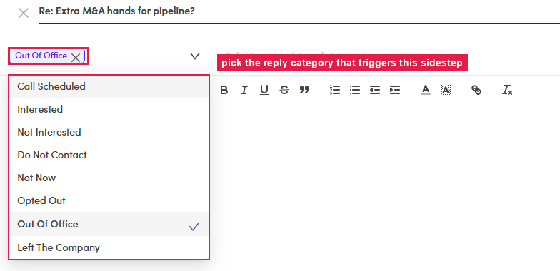
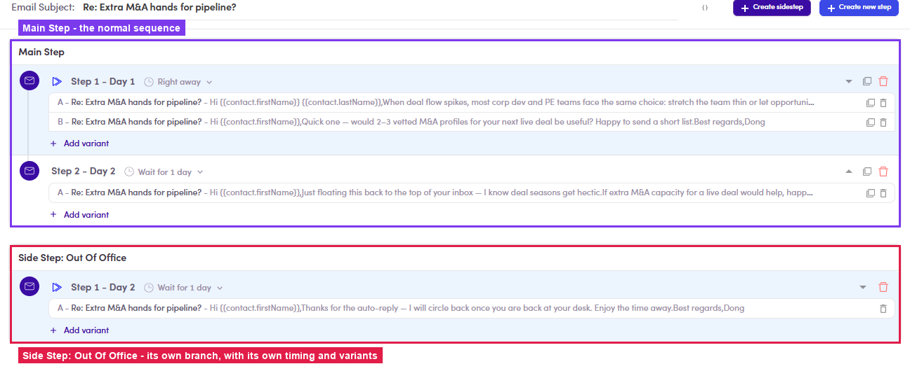

# 6.x.2 · Sidestep (conditional)

> 6 · Manage a campaign → 6.x · Edge cases

**Sidestep — a conditional branch.** A sidestep is an email that fires **automatically when a contact's reply lands in a chosen category** — e.g. an auto-response to an **Out Of Office**. Build one:

- **Steps** tab → **+ Create sidestep**.

- **Pick the trigger condition** (the chip, top-left of the editor). The list: **Call Scheduled · Interested · Not Interested · Do Not Contact · Not Now · Opted Out · Out Of Office · Left The Company**.

- **Write the email** — same editor as any step (template / variables / snippets all work) → **Create**.

- The Steps tab now shows **two blocks**: **Main Step** (the normal drip) and **Side Step: ‹condition›** — a branch of its own, with **its own timing and variants**.

*6.x.2 — the trigger-condition list: the sidestep fires when the reply is categorized as this.*

*6.x.2 — after Create: Main Step (the drip) + Side Step: Out Of Office — its own branch with its own timing/variants.*
