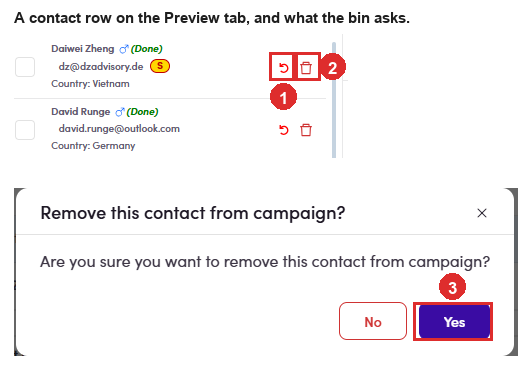

# 6.x.20 · Buttons on a contact row

> 6 · Manage a campaign → 6.x · Edge cases

**The buttons on a single contact row.** On the **Preview** tab, each contact in the left-hand list carries its own controls. Which ones you see depends on whether that person is already marked done. **Removing is not skipping.** The bin takes them out of the campaign altogether; skipping leaves them in and drops one email ([6.x.13 ↗](6-x-13-skip-a-step-not-sent.md)).

| Button | Shows when | What it does |
|---|---|---|
| **✓** green tick | the contact is **not** done | asks *Done this contact?*, then tags that one person **(Done)**. |
| **↺** undo | the contact **is** done | asks *Undone this contact?* and clears the tag. It replaces the tick, so a row never shows both. |
| **🗑** bin | always | **removes that one contact from the campaign.** |

*6.x.20: ① undo, on a contact already marked done · ② the bin · ③ what the bin asks first.*

> **This bin does ask. The bulk one does not.**
>
> Removing one person here opens *Remove this contact from campaign?* with **No** and **Yes**. Removing people from the **People** tab with **Remove from campaign** happens immediately, with nothing asked ([6.4.7 ↗](6-4-7-remove-no-undo.md)). **The safer control is the one that handles one person.**
