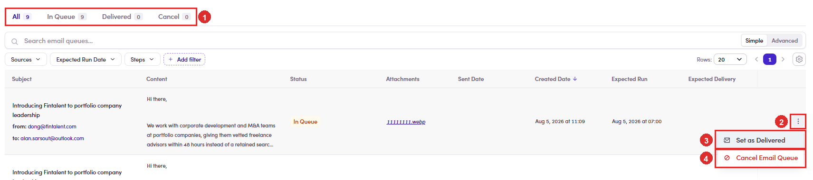
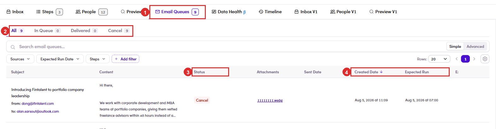

# 6.x.22 · Cancel a queued email

> 6 · Manage a campaign → 6.x · Edge cases

**Cancel a queued email.** An email sitting in **In Queue** has not been sent, so it can still be stopped. On the row, open the **⋮** menu and choose **Cancel Email Queue**. It moves to the **Cancel** tab and nobody receives it. Cancelling **does not delete the row**. It stays in the queue with the status **Cancel**, which is what you want: the record of what was going to go out, and the fact that it was stopped. The menu only exists on rows that are still **In Queue**. Once a row is **Delivered** or **Cancel** there is nothing left to decide, so the **⋮** is gone. **This is the last point at which you can take something back.** Once a row reaches **Delivered**, it has left, and the only remaining moves are on the reply side ([6.8 ↗](6-8-verify-replies.md)). Cancelling one queued email is not the same as skipping the step for that contact. Skip is a decision about the sequence and survives; cancel applies to this one queued row only ([6.x.13 ↗](6-x-13-skip-a-step-not-sent.md)).

*6.x.22: ① the four tabs, with nine still In Queue · ② the ⋮ on the row · ③ Set as Delivered, which sends it ([6.x.23 ↗](6-x-23-set-as-delivered.md)) · ④ Cancel Email Queue.*

*6.x.22, afterwards: ① the tab still reads 9 · ② but the split is now In Queue 0, Cancel 9 · ③ every row says Cancel · ④ the dates stay on the row even though the send never happens.*
