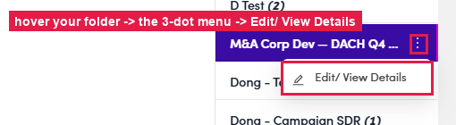
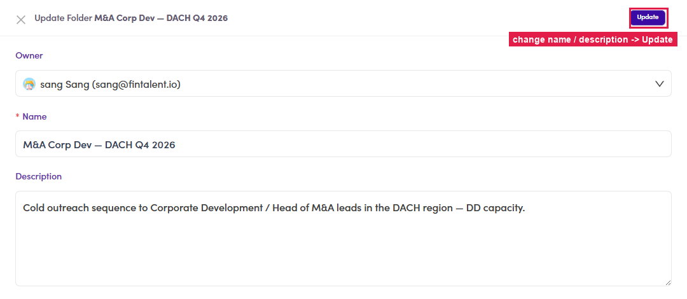

# 6.x.3 · Folders & owner

> 6 · Manage a campaign → 6.x · Edge cases

**Folders & owner — and editing your own.** Campaigns are organised into **folders** (right rail, each with a count). A folder has an **Owner** — set on create (6.1.2); it decides whose group the campaign shows under. Use folders to keep campaigns per teammate / segment / region. **Edit your own folder:** hover it in the rail → the **⋮** menu → **Edit/ View Details** → the **Update Folder** drawer (Owner · Name · Description) → **Update**.

*6.x.3 — hover your folder → ⋮ → Edit/ View Details.*

*6.x.3 — the Update Folder drawer: change Name / Description → Update.*
