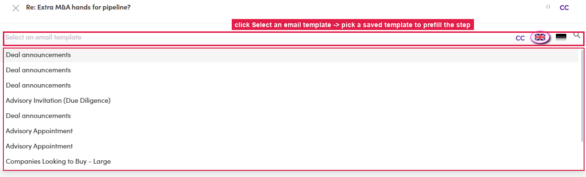

# 6.x.7 · Start from a Template

> 6 · Manage a campaign → 6.x · Edge cases

**Start from a saved Template.** In the step editor, click **Select an email template** (top) → the list of saved templates opens → picking one **prefills the whole step** (subject + body). You build & manage the templates themselves in [Flow 3.x.1 · Templates ↗](3-x-1-templates-use-and-create.md).

*6.x.7 — Select an email template opens the saved-template list; picking one prefills the step.*
