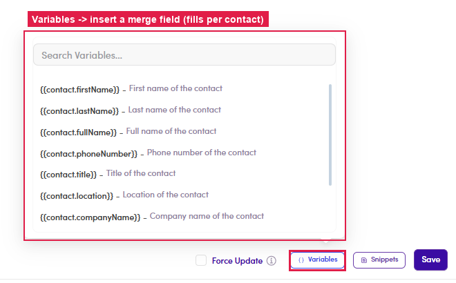

# 6.x.8 · Variables

> 6 · Manage a campaign → 6.x · Edge cases

**Variables (merge fields) — the right way to personalize at scale.** **Never type a name by hand** ("Hi [Name]" stays literal). Put your cursor in the **body** → click **Variables** → pick a field — it inserts a token like `{{contact.firstName}}` that fills in **per contact** at send time. The list covers **First name · Last name · Full name · Phone number · Title · Location · Company name** and more (searchable). For the **Subject** line, use the **{ }** icon (top-right, next to CC).

*6.x.8 — Variables: pick a merge field; it fills in per contact when the step sends.*
