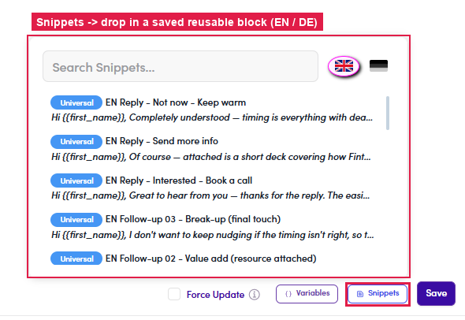

# 6.x.9 · Snippets

> 6 · Manage a campaign → 6.x · Edge cases

**Insert a Snippet.** Click **Snippets** (it enables once your cursor is in the body) → search & pick a saved reusable block. The picker has **EN / DE** tabs for each language. You build snippets in [Flow 3.x.2 · Snippets ↗](3-x-2-snippets-use-and-create.md).

*6.x.9: Snippets: drop in a saved block (EN / DE).*
