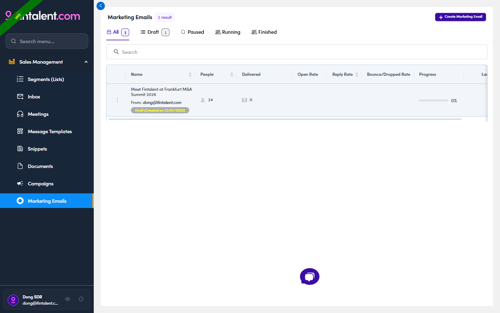
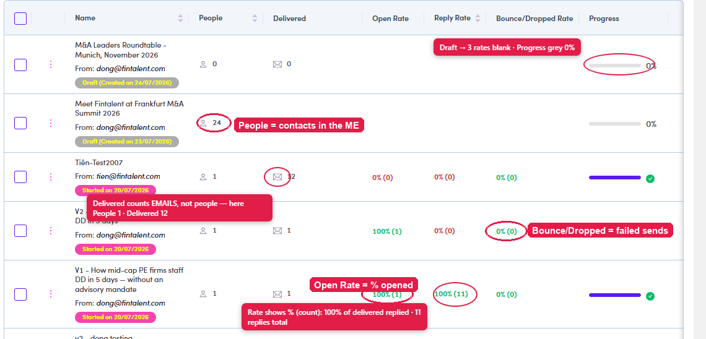

# 7.2 · View your MEs

> 7 · Manage a Marketing Email

Left menu → **Marketing Emails** shows every ME you can work on. They come from **two sources**:

* **You created it** yourself (7.1).

* **Admin / Ops created it and assigned you** — already set up, often with people already added. This is the usual case.

The tabs across the top filter the list by **status** (each with a count):

| Tab | What it means |
|---|---|
| **All** | Every ME you can access, whatever its status. |
| **Draft** | Created but **not sent yet** (not activated). Still fully editable — this is where a ME sits while you build & review it. |
| **Running** | **Active and sending** (or scheduled to). Shows a **Started on…** chip. Admin flips it here from Draft. |
| **Paused** | Was Running but **temporarily stopped** — no sends go out until it's resumed. |
| **Finished** | The run is **complete** — every queued email has gone out. |

*7.2 — the ME list: the All / Draft / Paused / Running / Finished status tabs + the per-ME numbers.*

#### 7.2a · Reading the numbers

Every row carries the ME's whole health check. Here's what each one actually counts:

| Column | What it means |
|---|---|
| **Name** | The ME's name, the **From** address it sends as, and its **status chip** — **Draft (created on…)**, **Started on…** or **Paused**. |
| **People** | How many contacts are **in the ME right now** (its recipient list). An old ME can show **0** if people were removed after it ran. |
| **Delivered** | How many emails were **actually delivered**. It counts **emails, not people** — one contact can receive several over time, so you'll see rows like **1 person / 12 delivered**. |
| **Open Rate** | **% opened**, with the raw count in brackets. **100% (1)** = the one delivered mail was opened. Higher = your subject line is landing. |
| **Reply Rate** | **% that got a reply**, with the **total number of replies** in brackets — so **100% (11)** means every delivered mail was answered, and 11 replies came in altogether. This is the number that matters most. |
| **Bounce/Dropped Rate** | **% that failed** (bounced or dropped), count in brackets. Anything above **0** is a to-do: those people never got it — reach them via [Flow 3 · 1:1 email ↗](3-send-a-1-1-email.md). |
| **Progress** | How far the send has got: an **empty grey bar + 0%** while it's still Draft; a **full purple bar + green ✓** once everything has gone out. |
| **Last run** | When the ME **last actually sent** (— if it never has). |

**Note:** the three rates stay **blank** on a **Draft** ME — nothing has been sent yet, so there's nothing to measure.

*7.2a — one real value circled per column: People (24) · Delivered (12 — emails, not people) · Open 100% (1) · Reply 100% (11) = % (count) · Bounce/Dropped 0% (0) · Progress (grey 0% on a Draft). Drafts show 0% and blank rates; sent MEs fill the bar + ✓.*

#### 7.2b · Inside a ME — the tabs

Open a ME and it splits into tabs. What each one is for:

| Tab | What it's for |
|---|---|
| **Templates** | The **email step(s)** — the actual content that gets sent. Build / edit steps here ([7b ↗](7b-create-edit-a-template.md)). |
| **People** | The **recipient list** — everyone the ME will go to, with the ME-only **Content Reviewed** / **Personalize** filters ([7.3 ↗](7-3-add-people-to-the-me.md)). |
| **Preview** | The **review gate** — see & personalize each contact's real email, then mark reviewed ([7.4 ↗](7-4-preview-and-mark-reviewed.md)). Appears once a step exists. |
| **Inbox** | **Replies** that come back on this ME — the same read/answer flow as [Flow 4 ↗](4-view-replies-and-answer-replies.md). |
| **Email Queue** | After **Force Send** — the queued emails in three tabs (**In Queue / Delivered / Cancel**). See [7.6 ↗](7-6-email-queue-3-tabs.md). |
| **Timeline** | The ME's **activity history** — what happened and when (created, edited, sent…). |

### In this step

* [7.2a · Reading the numbers](7-2a-reading-the-numbers.md)
* [7.2b · Inside a ME (tabs)](7-2b-inside-a-me-tabs.md)
