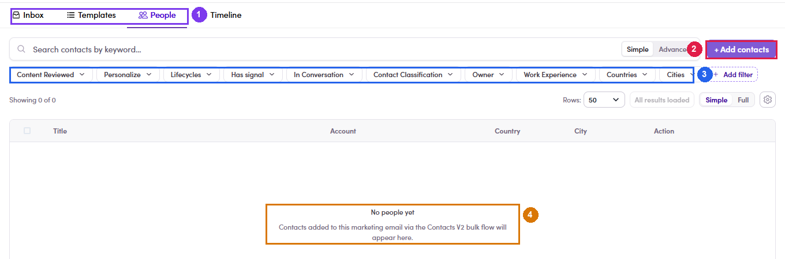

# 7.3.1 · Open your list

> 7 · Manage a Marketing Email → 7.3 · Add people to the ME

**Route 1 — open the ME and go to the *People* tab.** A new ME opens on four tabs: **Inbox · Templates · People · Timeline**. People is the recipient list, and while it is empty it says so plainly. The tab carries the **same filter bar as your lists** (Lifecycles, Has signal, In Conversation, Countries, Cities…) **plus two that exist only here**: **Content Reviewed** and **Personalize** — the two states you work through in [7.4 ↗](7-4-preview-and-mark-reviewed.md).

*7.3.1 — ① the four tabs · ② + Add contacts · ③ the filter bar, with Content Reviewed and Personalize at the front · ④ the empty state.*
