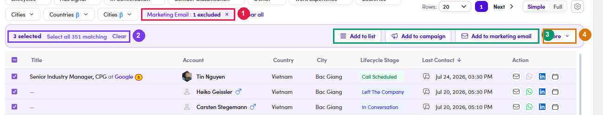

# 7.3.2 · Find the people

> 7 · Manage a Marketing Email → 7.3 · Add people to the ME

**Click *+ Add contacts* — and notice where it takes you.** It does not open a picker. It **navigates to the Contacts page** with a filter already applied: **Marketing Email : 1 excluded**. That chip means “**hide everyone already in this ME**”, so whatever you select next is guaranteed to be new. Leave it alone. If you clear it you will be looking at people who are already recipients. Yes, the SDR has a Contacts page nowIt is not in the left menu — you reach it through this button, and through the equivalent buttons on lists. Everything on it obeys the same rules as your lists.

*7.3.2 — ① the pre-applied Marketing Email : 1 excluded chip · ② the selection counter and Select all N matching · ③ the bulk actions · ④ More.*
