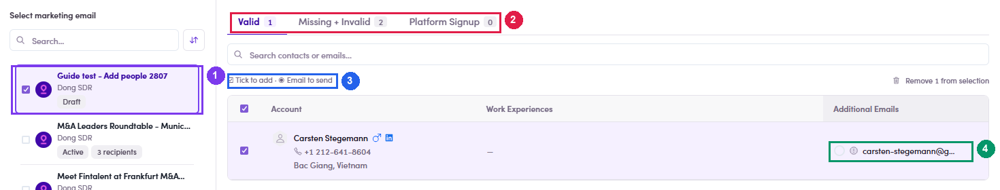

# 7.3.4 · Pick ME + email

> 7 · Manage a Marketing Email → 7.3 · Add people to the ME

**The drawer: pick the ME on the left, pick the addresses on the right.** It is titled **“Add N contacts to marketing email”** and has two halves. **Left — Select marketing email.** Every ME you can write to, each showing its owner, its **status badge** (Draft / Active) and its **recipient count**. Come from route 1 and yours is already selected. There is a search box and a sort toggle, because this list grows. **Right — the contacts you ticked, split by address quality.** This is the part people misread: The counts on the tabs are the split of *your* selection, so they are a quick verdict on the batch: tick 3 people and see **Valid 1 · Missing + Invalid 2**, and you have just learned that two of them are not reachable. **Two controls, two different jobs**, spelled out in the legend above the table: **☑ Tick to add** decides *who* joins the ME; **◉ Email to send** decides *which address* is used, because a contact can carry several and a ME sends to **exactly one per person**. Changed your mind about someone? **Remove N from selection** at the top right drops them. The confirm button stays **greyed out while nothing is ticked** — which is what you see if your whole batch landed in Missing + Invalid.

| Tab | What is in it | Ticked by default? |
|---|---|---|
| **Valid** | Verified addresses. These are the ones you actually want. | **Yes** |
| **Missing + Invalid** | No address, or one that failed validation. | **No** — shown, but you must tick them on purpose |
| **Platform Signup** | The address they registered on the platform with. | **No** |

*7.3.4 — ① the ME, with status and recipient count · ② the three address tabs and their counts · ③ the legend: tick to add, radio to choose the address · ④ Remove N from selection · ⑤ confirm.*
