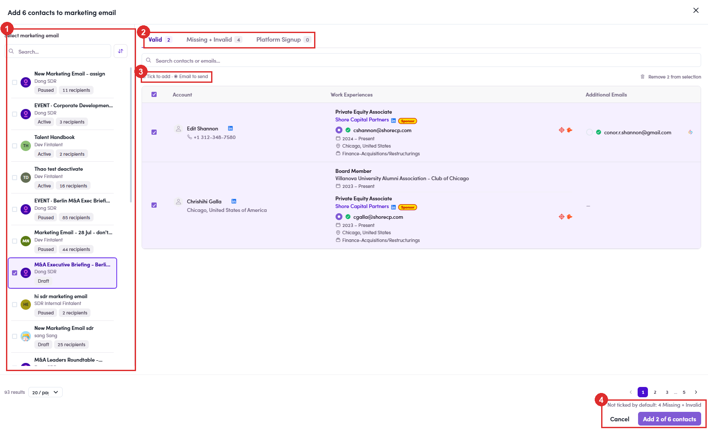

# 7.3.4 · The drawer — two panes

> 7 · Manage a Marketing Email → 7.3 · Add people to the ME

**The drawer is two panes, and both matter.** It opens titled **Add N contacts to marketing email**. **Read the legend above the table** — *“☑ Tick to add · ◉ Email to send”*. Two different controls: the checkbox decides **whether** the contact goes in, the radio beside each address decides **which address** gets used. **What each bucket actually means — and when to tick it:** **When a contact has more than one address, the system has already chosen one.** It picks by priority — a **valid** address first, then one belonging to a **sponsor company**, and so on down. The chosen address carries the filled radio; any others sit under **Additional Emails**. **You can overrule it right here.** Click the radio next to a different address and that is where the email goes. Worth a look whenever someone has a work address and a personal one — the automatic pick is a sensible default, not a decision about which inbox this particular message belongs in.

| Pane | What it does |
|---|---|
| **Left — Select marketing email** | every ME you can reach, searchable and sortable. Each row shows **name · owner · status chip · N recipients**, so you can tell a Draft from something already sending before you pick it. |
| **Right — the contacts** | split into three buckets: **Valid** · **Missing + Invalid** · **Platform Signup**, each with its own count. **They are not a quality ranking** — which ones you tick depends on what the email is for. See below. |

| Bucket | What is in it | Tick it? |
|---|---|---|
| **Valid** | The safe ground. The address is confirmed working, so a send has a high chance of landing rather than being dropped. | **Yes** — pre-ticked for you. |
| **Missing + Invalid** | **Needs a human look.** The *work* address is missing or unusable, so the pick falls back to a personal one — unverified rather than proven bad. Most are reachable; nobody has checked. | **Your call.** Tick individually if you are willing to risk a bounce on that name; leave it if you would rather not spend the sender reputation. |
| **Platform Signup** | People who **already have a Fintalent account** — talent or client. Nothing to do with whether the address works. | **Depends entirely on the campaign.** See the rule below. |

| The email is aimed at… | Platform Signup | Why |
|---|---|---|
| **Talents** | **Tick all of them** | These are your talents. Leaving them out means mailing everyone except the audience. |
| **Prospective clients** | **Judgement call** | Having an account already suggests they may be a client. Whether that makes them a target or means you should leave them alone depends on the campaign — decide deliberately, do not let the default decide for you. |

*7.3.4 — ① pick the ME (status and recipient count on every row) · ② the three buckets · ③ tick-to-add vs email-to-send · ④ the confirm button and the line above it.*
