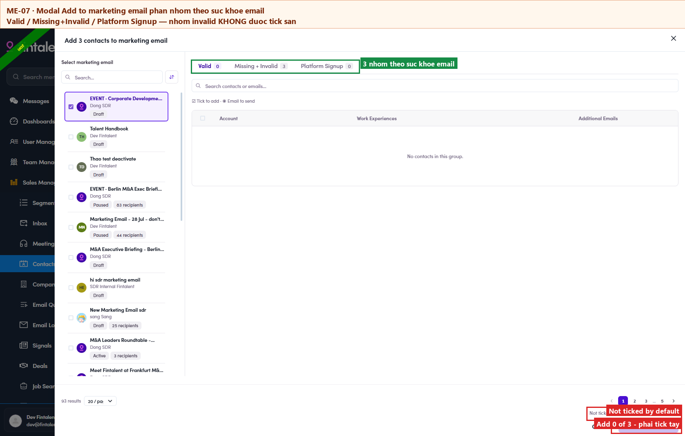

# 7.3.5 · Add

> 7 · Manage a Marketing Email → 7.3 · Add people to the ME

**Click *Add to marketing email* — and check the People tab.** It should show the people you picked, each row carrying **the address that will be used** under the name. This is where it currently failsThe count stays at **0** and no message appears. The request that was rejected is
`UpdateMarketingEmailRecipients`, and the reply is **403 PermissionGuard** — a role permission, not
anything you did wrong. Retrying will not help. Hand the list to Admin/Ops instead.

## What Admin/Ops sees when they do it

The same button opens a modal that **sorts your contacts by email health** before anything is added:

| Group | Meaning |
|---|---|
| **Valid** | address passed validation |
| **Missing + Invalid** | no address, or one that failed validation |
| **Platform Signup** | the address they signed up with |

**The invalid group is not ticked by default.** The footer says so — *"Not ticked by default: 3
Missing + Invalid"* — and the button reads **"Add 0 of 3 contacts"** until someone opens that tab and
ticks them by hand. It then reads **"Add 3 of 3 contacts"**.

So contacts with a bad address **can** be added, but only deliberately. Left alone, the modal quietly
adds nobody — which reads like a failure if you do not notice the count in the button.

*7.3.5 — the three groups, the "not ticked by default" note, and the count baked into the button.*
