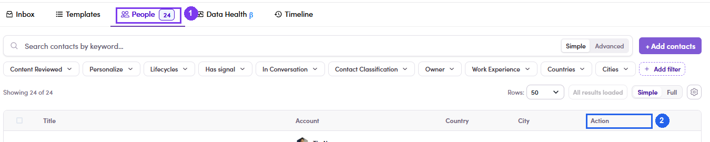

# 7.3 · Add people to the ME

> 7 · Manage a Marketing Email

Verified on UAT, 28 Jul 2026 — the screens work, the save does notEvery screen below is live for the SDR role and behaves exactly as described, right up to the final button. That button then fails: the API rejects the save with **403 — PermissionGuard** and **the interface shows no error at all**. The drawer simply closes and the People tab still reads **0**. Until this is fixed, **ask Admin/Ops to add the recipients**, and treat this section as the map of a flow you can walk but not finish. **Removing** people, by contrast, works — see [7.3.6 ↗](#m7-3-6).

There are **two ways in**, and they meet at the same drawer. Which one you use depends on where you are standing:

| Start from | Use it when |
|---|---|
| **The ME itself** — People tab → **+ Add contacts** | You have the ME open and want to fill it. Fastest, and it pre-filters the contact list for you. |
| **A list** — Segments → select → **Add to marketing email** | You are already working a list and spot people who belong in a ME. |

1. **7.3.6** — **Removing people, which does work.** On the **People** tab, tick whoever should not receive the ME → **Remove contacts**. No confirmation, no undoThe row disappears the moment you click, the count on the tab drops, and nothing asks whether you meant it. Tick carefully — putting someone back means the add flow above, which is the one that is blocked. The same bar also offers **Add to list · Add to campaign · Add to marketing email · More**, so a recipient can be pushed into another ME or campaign from here.

   

   *7.3.6 — ① the People tab with its live recipient count · ② Remove contacts, next to the add actions.*

2. **7.3.7** — **Assigned a ME that already has people?** Then none of this applies — skip to [7.4 ↗](7-4-preview-and-mark-reviewed.md) and work the recipients you were given. See [7.x.13 ↗](7-x-13-assigned-skip-add.md).

### In this step

* [7.3.1 · Open your list](7-3-1-open-your-list.md)
* [7.3.2 · Find the people](7-3-2-find-the-people.md)
* [7.3.3 · Select → Add to ME](7-3-3-select-add-to-me.md)
* [7.3.4 · Pick ME + email](7-3-4-pick-me-email.md)
* [7.3.5 · Add](7-3-5-add.md)
