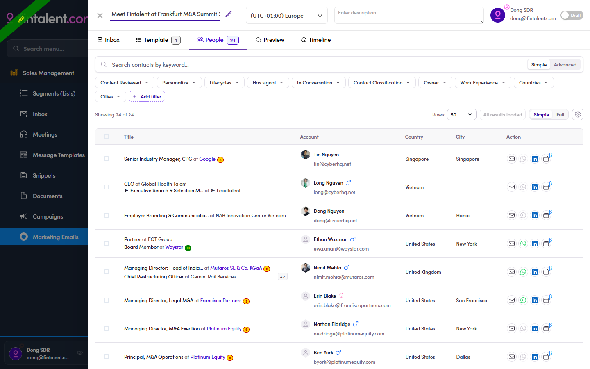

# 7.3 · Add people to the ME

> 7 · Manage a Marketing Email

Not available yet for SDRThis flow **isn't available to the SDR role yet** — the contact list has **no select + "Add to marketing email"** action. For now, your MEs come with people **already added by Admin / Ops**. The steps below are the intended flow, for when it ships.

**Assigned an ME that already has people** and told not to add more? **Skip this section** — just work those contacts (see [7.x.13 ↗](7-x-13-assigned-skip-add.md)).

Recipients come from your lists:

They now appear on the ME's **People** tab — the full recipient list. It has the same table & filters as your lists, **plus two ME-only filters**: **Content Reviewed** (has this person's mail been checked?) and **Personalize**.

*7.3 — the People tab: everyone who will receive this ME, plus the Content Reviewed and Personalize filters.*

### In this step

* [7.3.1 · Open your list](7-3-1-open-your-list.md)
* [7.3.2 · Find the people](7-3-2-find-the-people.md)
* [7.3.3 · Select → Add to ME](7-3-3-select-add-to-me.md)
* [7.3.4 · Pick ME + email](7-3-4-pick-me-email.md)
* [7.3.5 · Add](7-3-5-add.md)
