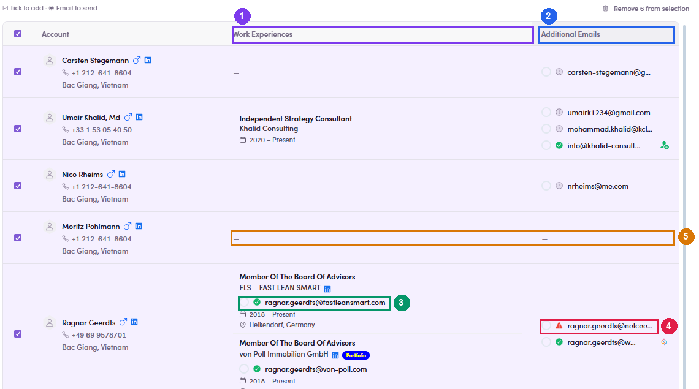

# 7.3 · Add people to the ME

> 7 · Manage a Marketing Email

Verified on UAT, 28 Jul 2026 — the screens work, the save does notEvery screen below is live for the SDR role and behaves exactly as described, right up to the final button. That button then fails: the API rejects the save with **403 — PermissionGuard** and **the interface shows no error at all**. The drawer simply closes and the People tab still reads **0**. Until this is fixed, **ask Admin/Ops to add the recipients**, and treat this section as the map of a flow you can walk but not finish. **Removing** people, by contrast, works — see [7.3.6 ↗](#m7-3-7).

There are **two ways in**, and they meet at the same drawer. Which one you use depends on where you are standing:

| Start from | Use it when |
|---|---|
| **The ME itself** — People tab → **+ Add contacts** | You have the ME open and want to fill it. Fastest, and it pre-filters the contact list for you. |
| **A list** — Segments → select → **Add to marketing email** | You are already working a list and spot people who belong in a ME. |

1. **7.3.5** — **What the drawer is actually doing — worth two minutes, because it decides who gets your email.** **It fetches nothing.** Opening the drawer fires no request; every tab, count and address on the right comes from the contact list you were already looking at. So the three tabs are not a server verdict, they are a **sort of the people you ticked**, done in the browser. **What puts a contact in each tab.** A contact's addresses come from two different places, and only one of them decides the tab: The three counts always add up to your selection, so a contact sits in exactly one tab. Two verdicts, one person, and they can disagreeAddresses are judged twice — once as part of a job, once in the contact's own validation record — and the drawer shows both without saying which is which. Seen on production data: a contact whose personal record marks *ragnar.geerdts@von-poll.com* **Invalid**, while the same address sits under his job with a **green tick**. And a contact whose record holds a perfectly valid address, but whose job address is still `Validating`, so he lands in **Missing + Invalid** anyway. **The tab follows the job address.** **The three marks next to an address:** ✔ green = validated · **⚠** red = failed validation · ⓘ grey = never checked. Grey is not a problem, it just means nobody has tested it. The address it will actually use is often not on screenThis is the part to be careful with. The radios let you **override** the choice — they are **not** preselected on the Valid tab, and the address the system falls back to is the **job address**, which the drawer frequently does not print anywhere. In one production batch a contact showed only a personal gmail in the list, yet the request sent his work address at the fund; another showed three addresses and used a fourth. One row showed **no address at all** in either column, ticked, in the Valid tab. **If it matters which address is used, pick one with the radio.** Do not read the list and assume the top one wins. **Three more behaviours worth knowing:**

   | Tab | The contact has… |
   |---|---|
   | **Valid** | at least one address attached to a **job**, carrying the verdict `Valid`. |
   | **Missing + Invalid** | no job address at all, or one whose verdict is `Invalid` — **or still `Validating`**, which is the one that surprises people. |
   | **Platform Signup** | a Fintalent account, i.e. they signed up as a talent. Usually **0** on a prospecting list. |

   

   *7.3.5 — ① Work Experiences: addresses tied to a job — these decide the tab · ② Additional Emails: the person's other addresses · ③ green tick on a job address · ④ red warning on a personal one that failed validation · ⑤ a contact with nothing shown in either column — ticked, and in the Valid tab.*

   | Looks like | Actually |
   |---|---|
   | The ME list on the left has **checkboxes** | **Single choice.** Tick a second ME and the first quietly clears. One drawer, one ME. |
   | Each tab has its own selection | **One selection, shared.** The counter reads the same on every tab, and switching tabs keeps your ticks. |
   | Leaving the Contacts page clears the ME filter | **It sticks.** Come back later and *Marketing Email : 1 excluded* is still applied. Handy, but check the chip before you trust a count. |

2. **7.3.7** — **Removing people, which does work.** On the **People** tab, tick whoever should not receive the ME → **Remove contacts**. No confirmation, no undoThe row disappears the moment you click, the count on the tab drops, and nothing asks whether you meant it. Tick carefully — putting someone back means the add flow above, which is the one that is blocked. The same bar also offers **Add to list · Add to campaign · Add to marketing email · More**, so a recipient can be pushed into another ME or campaign from here.

   

   *7.3.7 — ① the People tab with its live recipient count · ② Remove contacts, next to the add actions.*

3. **7.3.8** — **Assigned a ME that already has people?** Then none of this applies — skip to [7.4 ↗](7-4-preview-and-mark-reviewed.md) and work the recipients you were given. See [7.x.13 ↗](7-x-13-assigned-skip-add.md).

### In this step

* [7.3.1 · Open your list](7-3-1-open-your-list.md)
* [7.3.2 · Find the people](7-3-2-find-the-people.md)
* [7.3.3 · Select → Add to ME](7-3-3-select-add-to-me.md)
* [7.3.4 · Pick ME + email](7-3-4-pick-me-email.md)
* [7.3.5 · Add](7-3-5-add.md)
