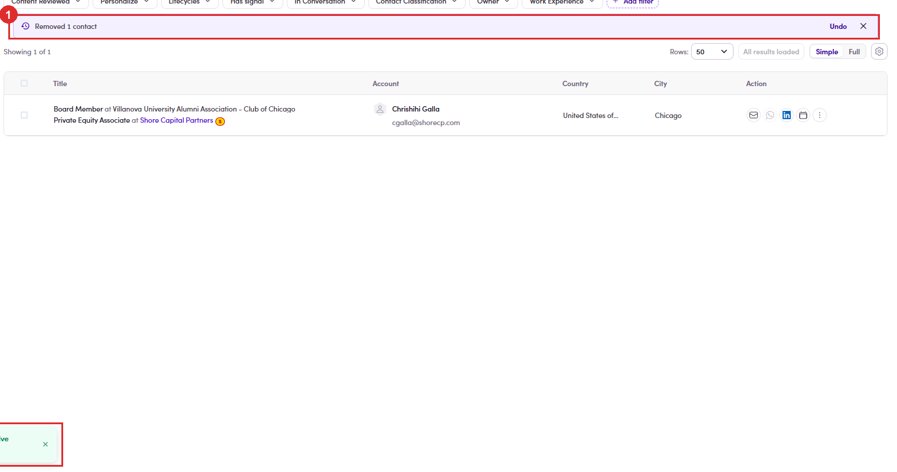

# 7.3b · Remove contacts

> 7 · Manage a Marketing Email

> **The other half of the list**
>
> Adding is [7.3 ↗](7-3-add-contacts-to-the-me.md); this is how people come back out. Same tab, same selection bar, but the confirmation behaves differently enough to be worth its own read.

## 7.3b.1 · Open the ME → People tab and tick whoever should not receive it

The selection bar is the same one you used to add: the count, **Select all N matching**, **Clear**. The action you want is **Remove contacts**. Removing takes them off *this* marketing email only. The contact record itself is untouched: this is not **Delete contacts**, which lives on the Contacts page and is a different thing entirely.

## 7.3b.2 · You get told twice, in two places, and they do not say the same thing

If you work several MEs at once, the toast is the one that tells you which list you just cut into.

| Where | What it says |
|---|---|
| **Banner**, above the table | *Removed 1 contact*, with an **Undo** beside it. Stays until you dismiss it. |
| **Toast**, bottom left | *Removed 1 contact from M&A Executive Briefing - Berlin, October 2026*, **the only one that names the email**. Clears on its own. |

*7.3b.2: ① the banner and its Undo · ② the toast, the only place the email is named.*

## 7.3b.3 · Undo really does put them back

Worked example: two recipients, removed one, **People** went 2 → 1; clicked **Undo** and it went back to **2** with the contact returned. Because the banner waits for you rather than fading, a wrong bulk remove is recoverable, as long as you notice before you navigate away.

> **🐛 After Undo the table lies until you reload**
>
> The **People** badge corrects itself, but the list underneath keeps the post-removal total, it read **People 2** and *Showing 1 of 1* at the same time. **Refresh before you trust the table**, and count off the badge, not the footer.

## 7.3b.4 · Once you leave the page, Undo is gone

There is no removal history and no bin to fish them out of, the only way back is to add them again from scratch ([7.3 ↗](7-3-add-contacts-to-the-me.md)). On a **Select all N matching** removal that is a real cost, so read the count in the bar before you confirm, not after.
