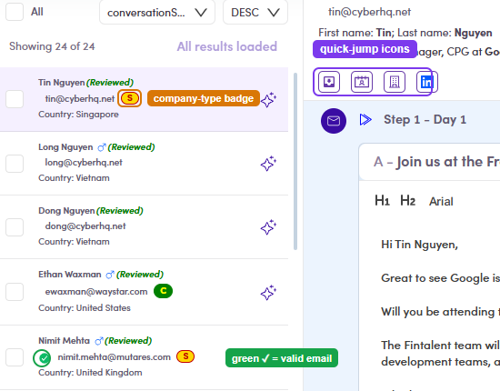

# 7.4.2 · Contact header

> 7 · Manage a Marketing Email → 7.4 · Preview & mark reviewed

**Read the contact header.** Above the email you get the contact's **name · email · title & company**, plus three quick reads: **1. Company-type badge** — the coloured letter next to the email: **2. Quick-jump icons** — the little row under the name; each opens this contact elsewhere ([full detail & screenshots → 7.x.4](7-x-4-quick-jump-icons.md)): **3. Row indicators** — shown on each contact's row in the left list ([full detail → 7.x.5](7-x-5-row-indicators.md)):

| Badge | Means |
|---|---|
|  | **Sponsor** company |
|  | **Corporate** company |
| P | **Portfolio** company |
|  | Email address is **valid** |

| Icon | Opens |
|---|---|
|  | **View Inbox** — their Conversations. |
|  | **View Profile** — their contact record. |
|  | **View Company** — their company page. |
|  | **View on LinkedIn** — their LinkedIn profile (new tab). |

| Mark | Means |
|---|---|
|  | **Personalized** — you edited this contact's email and hit **Save** (7.4.4). |
| (Reviewed) | **Content-reviewed** — the “done” mark, after **Mark as reviewed** (7.4.5). |

*7.4.2 — a contact row + header: the company-type badge, green ✓ valid email, and the quick-jump icons.*
