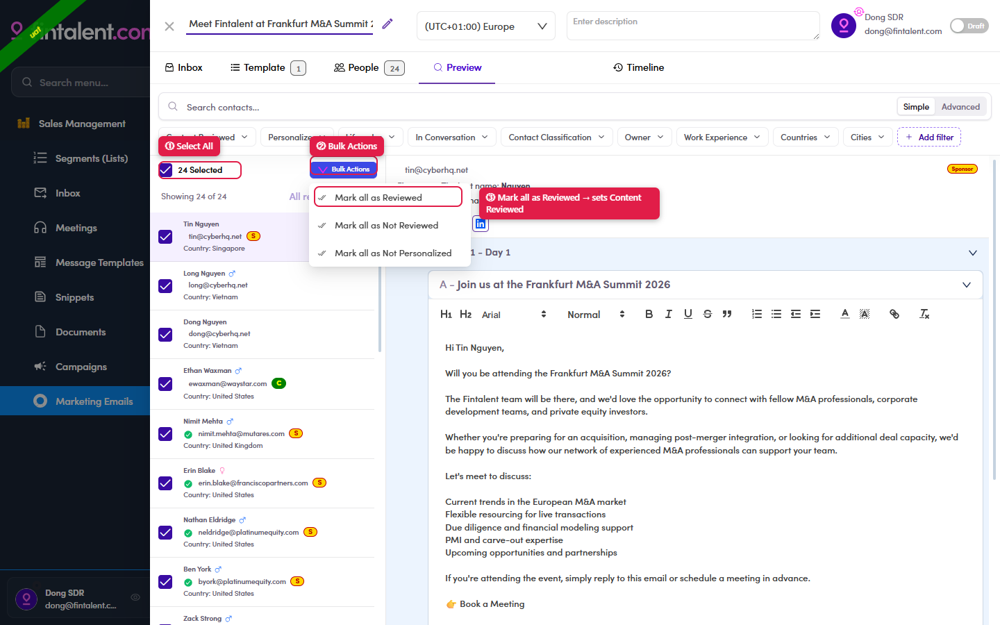

# 7.4.5 · Mark reviewed

> 7 · Manage a Marketing Email → 7.4 · Preview & mark reviewed

When the batch is done: **select the contacts** (**All** at the top selects everyone) → **Bulk Actions** → **Mark as reviewed**. That sets **Content Reviewed** on them.

*7.4.5 — ① Select All · ② Bulk Actions · ③ Mark all as Reviewed (sets Content Reviewed).*

**Bulk Actions holds three items:** *Mark all as Reviewed* · *Mark all as Not Reviewed* ·
*Mark all as Not Personalized*.

> ## Nothing is queued until this is done
> **The send queue is only built for contacts marked reviewed.** Walked on UAT 30 Jul 2026: an ME with
> 3 recipients was set Active and force-sent while **0 were reviewed** — the Email Queues tab stayed
> empty, and **no error or warning appeared anywhere**. Marking all 3 reviewed and force-sending again
> produced all 3 rows immediately.
>
> If the queue is empty after a force send, check this first.

> ## Personalizing is not reviewing
> Writing a personal version for a contact and clicking **Save** does **not** tick Content Reviewed.
> On the same walk, one contact was personalized and the Run dialog still read **`0 reviewed`** with
> *"3 of 3 recipients have not been reviewed"*. The two flags are independent — you must come back and
> mark reviewed explicitly.
