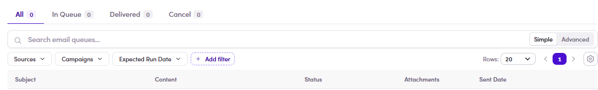

# 7.6 · Email Queue (3 tabs)

> 7 · Manage a Marketing Email

The queue is your control room. Every email sits in one of three tabs:

| Tab | What it means |
|---|---|
| **In Queue** | **Will be sent, but hasn't gone yet** — waiting in the queue. |
| **Delivered** | **Already sent.** |
| **Cancel** | **Removed from the queue** — these will **not** be sent. |

*7.6 — the Email Queue tab: In Queue · Delivered · Cancel (+ All), with columns Subject · Content · Status · Attachments · Sent Date and Sources / Campaigns / Expected Run Date filters.*

**Heads-up:** the SDR **Email Queues** list can be slow or show **0 / “Couldn't load”** for a while after a send — even when the email already went out. If it looks empty, refresh, or just confirm the send in the contact's [Conversations (7.7) ↗](7-7-verify-in-conversations.md).

Act on a row from the **⋮ three-dot** menu (on rows in **In Queue**):

* **Set as delivered** — send that email **right now**, without waiting for the queue.

* **Cancel email queue** — pull it out of the queue so it is **never** sent.

Check before you leave itAnything left in **In Queue** **will** go out. If someone shouldn't receive it, **cancel** them — don't just ignore the row.
