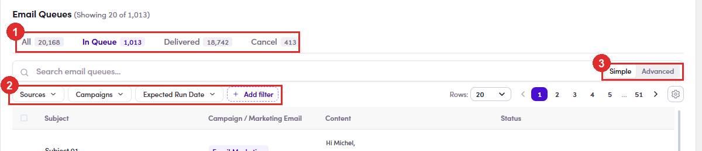
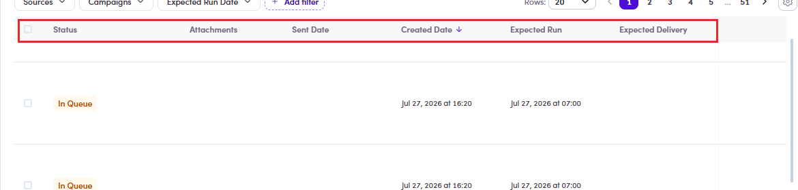
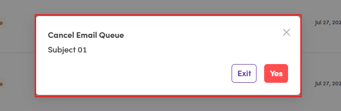
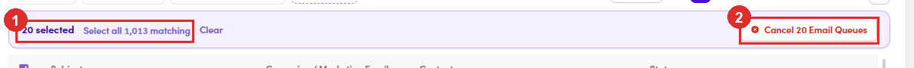
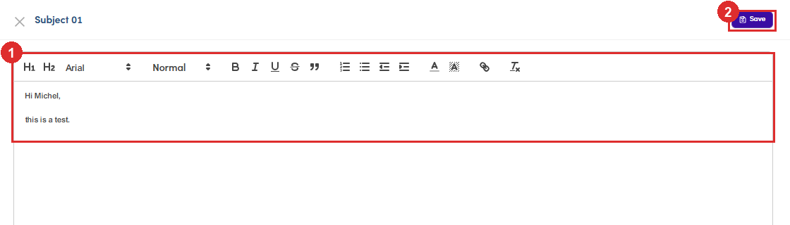

# 7.6 · Email Queue (3 tabs)

> 7 · Manage a Marketing Email

1. **7.6.1** — **Two ways in, and they are not the same view.** The **Email Queue** tab inside a ME is already scoped to that ME. **Sales Management → Email Queues** in the left menu is the whole platform — it mixes three sources: The **Campaign / Marketing Email** column tells you which, with a chip for the source and a link to the campaign or ME by name. On the global page, **read that column before you act on a row** — it is easy to cancel a campaign email thinking it belongs to your ME.

   | Source | Where the email came from |
   |---|---|
   | **Email Marketing** | a marketing email — this flow. |
   | **Campaign** | a campaign step ([Flow 6 ↗](6-manage-a-campaign.md)). |
   | **Task** | a one-off task email. |

2. **7.6.2** — **Four tabs, not three.** Each carries a live count: Measured on UAT: All 20,168 · In Queue 1,013 · Delivered 18,742 · Cancel 413.

   | Tab | What is in it |
   |---|---|
   | **All** | everything, whatever its state — the tab people forget exists. |
   | **In Queue** | will be sent, has not gone yet. **The only tab where the row actions do anything.** |
   | **Delivered** | already sent. |
   | **Cancel** | pulled out of the queue — these will never be sent. |

   

   *7.6.2 — ① the four tabs with their counts · ② the filter bar · ③ rows-per-page and the column settings gear.*

3. **7.6.3** — **Narrowing it down.** Quick filters are **Sources**, **Campaigns** and **Expected Run Date**, plus **Add filter** to pin more. The search box has a **Simple / Advanced** toggle. The date filter changes meaning with the tabOn **Delivered** you filter by **sent date**. On **In Queue** and **Cancel** there is no sent date yet, so you filter by **queued date** instead. Same-looking control, different question — worth knowing before you conclude a date range is empty.

4. **7.6.4** — **Read a row.** Beyond Subject and Status: **from** and **to** under the subject, a **Content** preview of the actual body, **Attachments**, and three dates — **Created**, **Expected Run**, **Expected Delivery** — with **Sent Date** filled in once it has gone. The recipient carries a small **coloured dot**: green when the contact has an email on file, grey when it does not.

   

   *7.6.4 — scroll the table sideways for the rest: Status, Attachments, Sent Date, Created Date, Expected Run, Expected Delivery.*

5. **7.6.5** — **Act on one row** — the **⋮** at the far right of an **In Queue** row: **Both ask first.** The confirmation names the email by **subject**, so you can check you have the right row before committing. **Exit** backs out; **Yes** commits — red on Cancel, because that one cannot be undone from here.

   | Action | What it does |
   |---|---|
   | **Set as Delivered** | send it **now**, without waiting for its slot. |
   | **Cancel Email Queue** | pull it out — it will never be sent. |

   

   *7.6.5 — the confirmation carries the subject of the email you are about to cancel.*

6. **7.6.6** — **Act on many rows.** Tick the header checkbox and a bar appears: how many are **selected**, **Select all N matching** to take the whole filtered set rather than just this page, **Clear**, and a red **Cancel N Email Queues**. **Bulk cancel is the only bulk action** — there is no bulk “send now”. Filter first, then select, then cancel: that is the fast way to stop a whole batch.

   

   *7.6.6 — ① the count and Select all 1,013 matching · ② the red bulk cancel, naming how many rows it will take.*

7. **7.6.7** — **You can still edit the email while it waits.** Click the row and it opens in an editor — subject at the top, the full body in a rich-text field, and **Save**. Whatever you save is what goes out. This is a live email, not a draftIt is queued and will send on its own. Fix a typo here and it goes out corrected; leave the editor open and it still sends on schedule. If the email should not go at all, **cancel it** — editing does not hold it back.

   

   *7.6.7 — ① the body, fully editable · ② Save.*

8. **7.6.8** — **If the list looks empty or stale, do not panic.** The SDR view of Email Queues can be slow or show **0** / “Couldn't load” for a while after a send, even when the mail has already gone. Refresh, or confirm the send in the contact's **Conversations** ([7.7 ↗](7-7-verify-in-conversations.md)) — that never lies.

9. **7.6.9** — **Before you walk away:** anything still sitting in **In Queue** will go out. If someone should not receive it, cancel their row. Ignoring it is not the same as stopping it.
