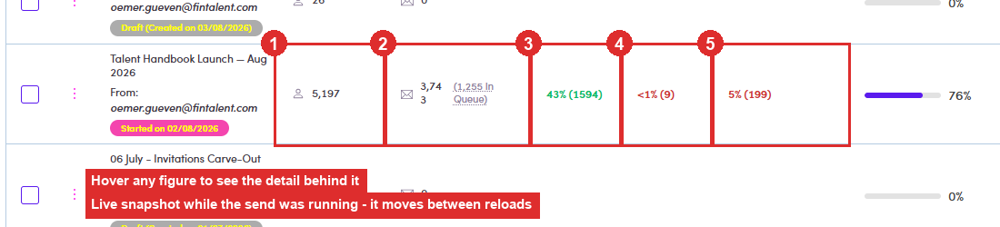

# 7.6b · Monitor the ME

> 7 · Manage a Marketing Email

> **This is the habit, not a one-off check**
>
> Once Admin has run it ([7.5 ↗](7-5-force-send-run-admin.md)), your job stops being *setting up* and becomes *watching*. Everything you need is on the **Marketing Emails list row**, the same figures introduced in [7.2 ↗](7-2-view-your-mes.md). You do not have to open the ME to know whether it needs you.

## 7.6b.1 · Read the row, and hover anything you are unsure of

Each figure has a meaning and a tooltip, **hover it and the detail behind the number appears**. Together they are your overview of the send, and the figures you quote when somebody asks how it went.

| Number | What it is telling you |
|---|---|
| **People** | how many contacts the ME holds. |
| **Delivered** | how many actually went out, with *(N In Queue)* beside it, still waiting for the daily release. |
| **Open Rate** | **opens measured against what was sent**, not against the whole list. Bracketed figure is the raw count. |
| **Reply Rate** | the one that matters. A reply is a person, not a metric, go read it. |
| **Bounce / Dropped Rate** | addresses that refused it. Treat as a to-do list, not a statistic. |

*7.6b.1: one row, \*Talent Handbook Launch — Aug 2026\*: ① People 5,197 · ② Delivered 3,743 with (1,255 In Queue) still waiting · ③ Open Rate 43% (1594) · ④ Reply Rate <1% (9) · ⑤ Bounce/Dropped 5% (199). Caught mid-send: the figures move every time you reload.*

## 7.6b.2 · Replies > 0 → open the Inbox tab and deal with them

Go to the ME’s own **Inbox** tab, read what each person actually wrote and what chip the system put on it, and decide whether it needs an answer. That is [7.7 ↗](7-7-verify-in-conversations.md) and [7.8 ↗](7-8-replies-bounce-drop.md), and if one of them is asking for a call, [Flow 4b ↗](4b-1-spot-it-in-your-replies.md).

## 7.6b.3 · Bounce / Dropped > 0 → find out who, then decide

Same **Inbox** tab, filter the lifecycle down to **Bounce / Dropped** so you are looking at names rather than a percentage. Then it is a judgement call per person: worth chasing a corrected address and sending again, or not worth it. If you do resend, it goes back through the normal send flow, see [7.7a ↗](7-7a-find-bounces-and-drops.md).

## 7.6b.4 · 🐛 The delivered figure does not agree with itself

Four screens claim to tell you how many went out, and they give four different answers for the same ME: Not a one-off. *Frankfurt Event - June 2026*: Inbox **359** vs Delivered **406**. *Frankfurt - Active/Passive Talents*: Inbox **804** vs Delivered **816**. The Inbox count comes out **lower every time**. **Which to trust:** for “did it go out”, use **Email Queue → Delivered**. It is the only one that reconciles (In Queue + Delivered + Cancel = All, exactly, on all three). Use the **Inbox** count for reading conversations, not for reporting. And **do not quote two of them in the same sentence.** The header percentage is `totalDelivered ÷ (totalDelivered + bounce + dropped)`, on Talent Handbook that is 3,738 ÷ 3,922 = **95% delivered and 5% bounced**, which is what the header shows.

| Where you read it | *Talent Handbook Launch — Aug 2026* |
|---|---|
| **Inbox** tab | **3,733** |
| Email Queue → **Delivered** | **3,741** |
| the figure behind the header **%** (`totalDelivered`) | **3,738** |
| the event log (`statusCount.delivered`) | **2,040** |
