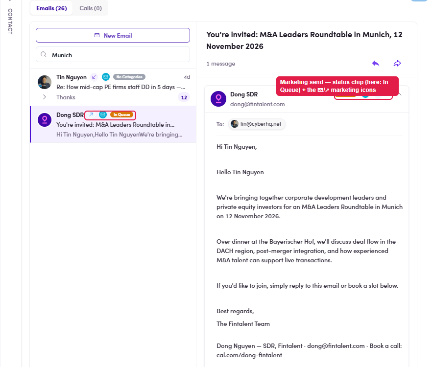
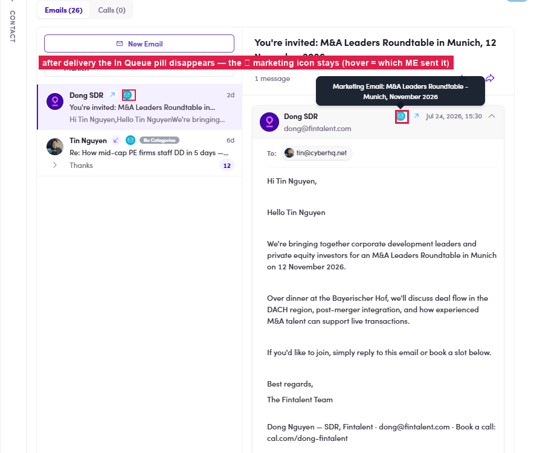
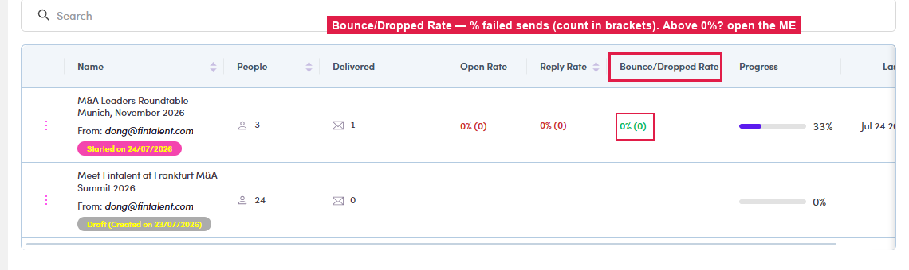
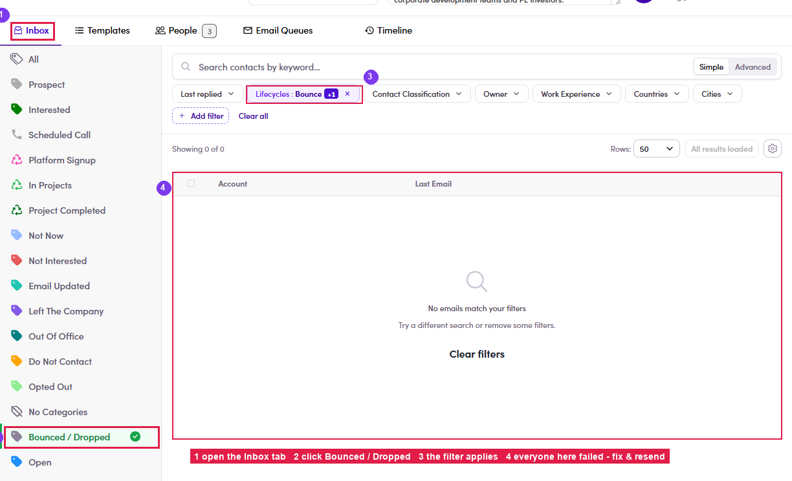

# 7.7 · Verify in Conversations

> 7 · Manage a Marketing Email

The moment your Admin force-sends, each email is written into that contact's conversation — even while it's still queued. To check:

**People** tab → open the **contact** → **Conversations** → find the thread with the **marketing icon**. Its **chip** tracks the whole life of the send:

| Chip | Means |
|---|---|
| In Queue | Queued, not sent yet. |
| Delivered | It went out. |
| Open | They opened it. |
| Click | They clicked a link in the email. |
| ⚠ Bounce / Dropped | It failed — that address didn't take it. |

*7.7 — the marketing send in the contact's Conversations: the thread carries the ✉/↗ marketing icons and a status chip (captured here as In Queue), and the body shows the personalized copy.*

*7.7 — after delivery the In Queue pill disappears — the ✉ marketing icon stays on the thread (hover it to see which ME sent it).*

When they **reply**, the thread also picks up the **reply icon** and a **lifecycle chip** per email (the system's read of the reply — see [Flow 4.2 ↗](4-1-view-and-answer-a-reply.md)).

#### 7.7a · Find who bounced / dropped — and fix it

A **bounce / drop** means that contact **never got the email**. Check for them after every send — step by step:

1. **7.7a.1** — **Spot it on the list.** On **Marketing Emails**, read the **Bounce/Dropped Rate** column — anything **above 0%** (count in brackets) means failed sends inside.

   

   *7.7a.1 — the Bounce/Dropped Rate column on the ME list.*

2. **7.7a.2** — **See exactly who.** Open the ME → **Inbox** tab → click the **Bounced / Dropped** category (left rail). The filter applies and **everyone listed is a failed send**.

   

   *7.7a.2 — ① Inbox tab → ② Bounced / Dropped → ③ the filter applies → ④ everyone here failed.*

3. **7.7a.3** — **Fix & re-reach.** For each failed contact: get the **email address corrected** on their profile (flag it to Admin / Ops if you can't edit it) — then **reach them another way**: a [1:1 email (Flow 3) ↗](3-send-a-1-1-email.md) to a working address, or [WhatsApp / LinkedIn (3.x.4) ↗](3-x-4-whatsapp-linkedin-instead.md). Once fixed, Admin / Ops can include them in the next send.

### In this step

* [7.7a · Find bounces & drops](7-7a-find-bounces-and-drops.md)
