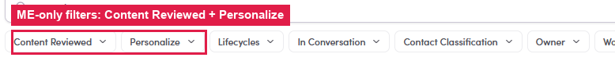

# 7.x.1 · Filter People / Preview

> 7 · Manage a Marketing Email → 7.x · Edge cases

**Filter the People / Preview list.** Both tabs carry the same filter bar as your lists, **Lifecycles, Has signal, Contact Classification, Owner, Work Experience, Countries and Cities**, plus two ME-only ones: **Content Reviewed** (checked yet?) and **Personalize**. Handy to review in batches, e.g. "show only the ones I haven't reviewed". Full reference: [Flow 8 · Using filters ↗](8-3-inbox-filters.md).

*7.x.1: the same filter bar, plus the ME-only Content Reviewed + Personalize filters.*
