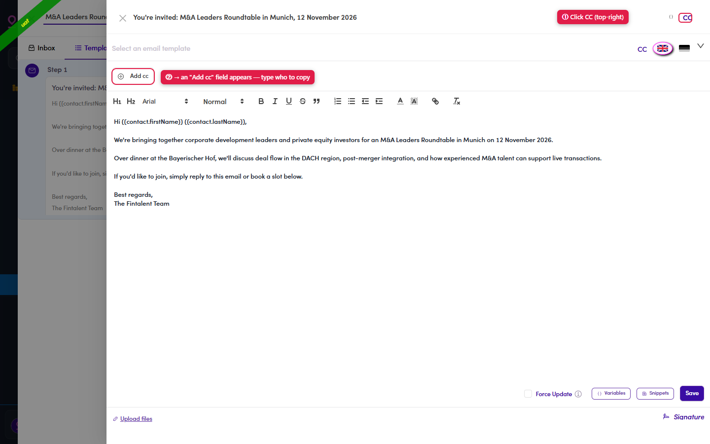

# 7.x.10 · CC

> 7 · Manage a Marketing Email → 7.x · Edge cases

**CC someone.** Click **CC** (top-right of the editor) → an **Add cc** field appears → type who to copy on every send of this step.

*7.x.10: ① click CC → ② an Add cc field opens to type the copied recipient.*
