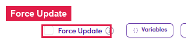

# 7.x.11 · Force Update

> 7 · Manage a Marketing Email → 7.x · Edge cases

**Force Update.** Tick this **before Save** to push your latest template edit onto everything already generated for this step. Its own tooltip: *"Force Update will apply the latest version of this email template to the current step in the campaign flow within the Preview tab — including personalized emails, marked-as-done steps, and previously saved versions."* Use with cautionIt **overwrites existing content** — any per-contact personalization, "reviewed" marks, or saved versions on this step are replaced by the new template. Leave it **unticked** on a fresh step that has no previews yet.

*7.x.11 — the Force Update toggle (with its ⓘ tooltip), bottom of the editor.*
