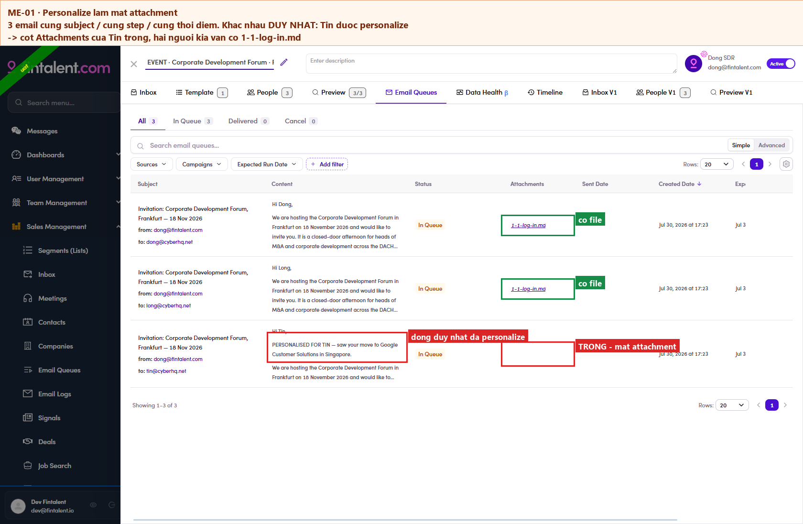

# 7.x.14 · Personalize drops attachment

> 7 · Manage a Marketing Email → 7.x · Edge cases

**Personalizing drops the attachment.** If you personalize a contact’s email, that contact stops receiving the file. Everyone you did *not* personalize still gets it. Worked example: one ME, one step, one attachment, three recipients, only one personalized. The two template rows carried **1-1-log-in.md**; the personalized row’s **Attachments** column was **empty**. Same subject, same step, same created time. The personalization is the only difference. You will not see it on screenPreview keeps showing the attachment for that contact, because Preview renders the file list from the **template** rather than from the contact’s own copy. It shows up only in the **Attachments** column of Email Queues, after the queue is built, so check that column before a send goes out whenever you have personalized anyone on an ME that carries a file. Removing a file deliberately is different: that is the **✕** beside the filename in Preview, and it affects only the contact you are looking at. Logged as **ME-01**.

*7.x.14: two rows carry the file, the personalized row does not.*
