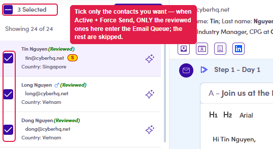

# 7.x.3 · Review a subset

> 7 · Manage a Marketing Email → 7.x · Edge cases

**Review a subset, not everyone.** You don't have to **Select All** — tick just the contacts you want and mark those reviewed. This matters because **only Content-Reviewed contacts go into the Email Queue** when the ME is activated and force-sent: anyone **not** reviewed is **skipped**. So marking a subset reviewed is a deliberate way to send to only those people.

*7.x.3 — tick a subset; only those (once reviewed) enter the queue on force send.*
