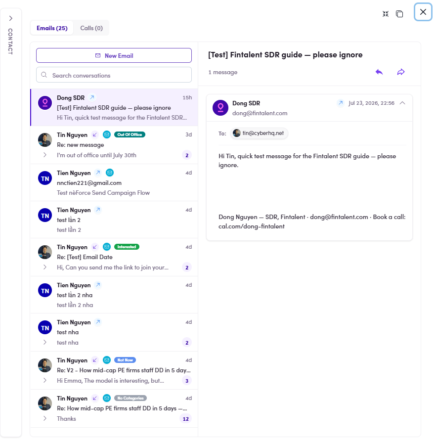
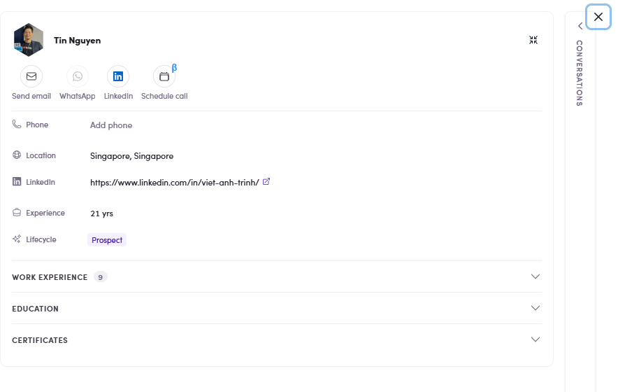
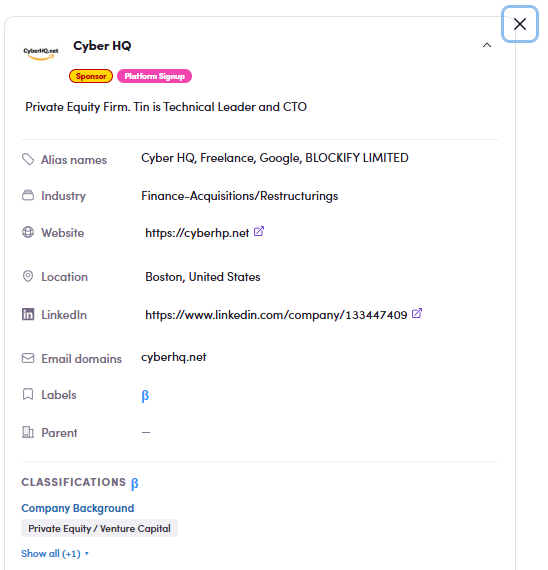
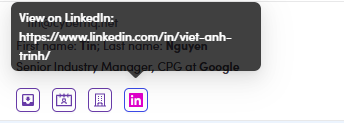

# 7.x.4 · Quick-jump icons

> 7 · Manage a Marketing Email → 7.x · Edge cases

**Quick-jump icons: where each one takes you.** The little row of icons under the contact's name (7.4.2) opens them elsewhere. Each icon and what it opens:

*View Inbox: the contact's Conversations: every email & call thread with them.*

*View Profile: their contact record: phone, location, LinkedIn, experience, work history.*

*View Company: their company page: industry, website, classifications, email domains.*

*View on LinkedIn, opens their LinkedIn profile in a new tab (hover shows the URL).*

> **A missing icon is information**
>
> An icon appears **only when the contact has that piece of data**. No company icon means no company is linked; no LinkedIn icon means the record has no LinkedIn URL. **Count them before you conclude the record is complete.**
