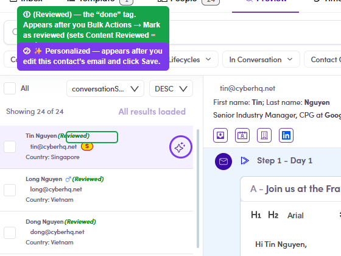

# 7.x.5 · Row indicators

> 7 · Manage a Marketing Email → 7.x · Edge cases

**Row indicators — Personalized & Reviewed.** Once you've acted on a contact, their left-list row tells you at a glance: **✨ Personalized** appears after you **edit that contact's email and click Save** (7.4.4); the green **(Reviewed)** “done” tag appears after **Mark as reviewed** (7.4.5). **Only reviewed contacts enter the Email Queue** on force send — anyone not reviewed is skipped.

*7.x.5 — the row shows ① (Reviewed) (the “done” tag) and ② ✨ Personalized once each is set.*
