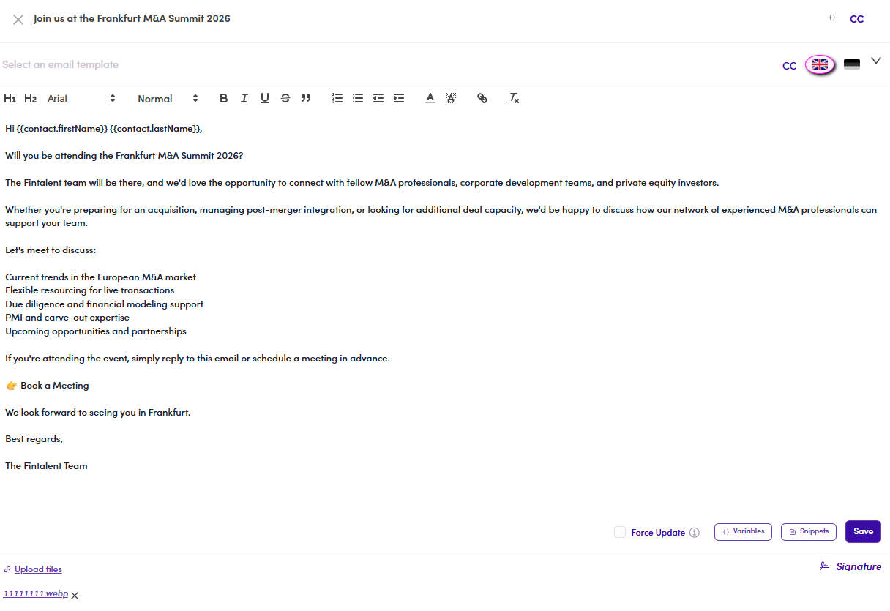

# 7.x.6 · Edit a step

> 7 · Manage a Marketing Email → 7.x · Edge cases

**Edit a template step.** Same place, same form: **Templates** tab → **click the step** → change the subject / body / attachments → **Save**. The **🗑 bin** on the step header deletes it. If per-contact previews were already generated, tick **Force Update** ([7.x.11](7-x-11-force-update.md)) so your edit reaches them.

*7.x.6: click a step to open the full editor: subject, body, toolbar and all controls.*
